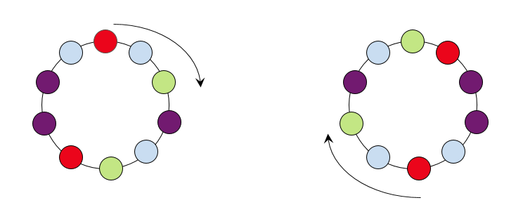
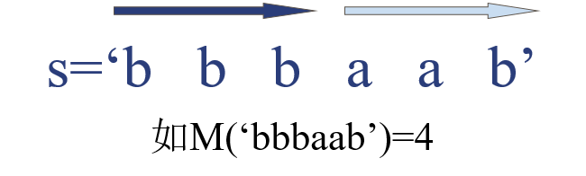
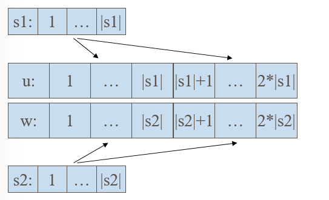
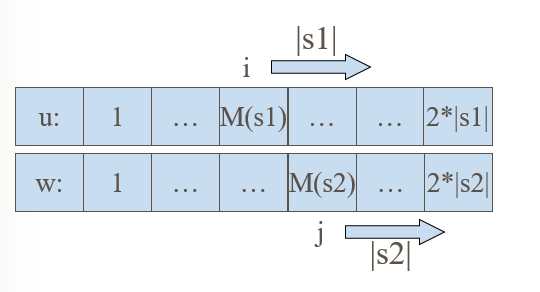
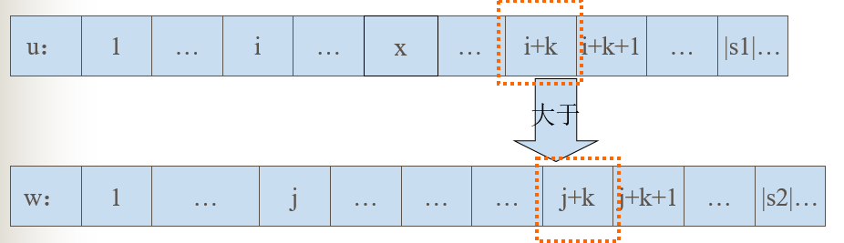
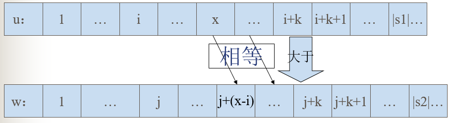
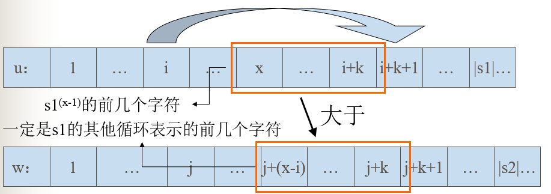

# 字符串专题

## 字符串匹配算法

字符串模式匹配问题：给定一个子串，要求在某个字符串中找出与该子串相同的所有子串，这就是模式匹配。

### 哈希算法 (Hash)

关于字符串哈希，就一句话：把字符串有效地，**“唯一”**的映射(通过哈希函数)到每个**“不同”**的整数，我们就能很好的处理字符串。 判断两个字符串是否一致，直接用他们的哈希值判断即可，若哈希值一致，则**认为**字符串一致；

常见的哈希算法：BKDRHash，APHash，DJBHash，JSHash，RSHash，SDBMHash，PJWHash，ELFHash，多重Hash，高维Hash。

一个简单的哈希函数：$Hash[i]=Hash[i-1]*P+idx(S[i])\%MOD\left ( i\subseteq [1,|S|],S[i]\overset{Mapping}{\rightarrow}>idx(S[i])\right )$ 

这表示第i个前缀的哈希值，是一个哈希的前缀和，那么对于字符串S的子串$S[l\cdots r]$的哈希值：

$$Hash[l\cdots r]=(Hash[r]-Hash[l]*P^{^{r-l+1}})+MOD)\%MOD \left ( l\subseteq [1,|S|],r\subseteq [1,|S|],r\geq l \right )$$ 

哈希算法非常强大，能解决的问题：单模式匹配，树的同构，高维字符串匹配，回文串，LCP等。

**推荐阅读：**

[各种字符串Hash函数比较](https://www.byvoid.com/zhs/blog/string-hash-compare) 

 [字符串hash以及7大问题(参见附件)](https://wenku.baidu.com/view/b7d3d1c6804d2b160a4ec090.html)  

[2005年国家集训队论文-杨弋《Hash在信息学竞赛中的一类应用》(参见附件)](https://wenku.baidu.com/view/6bfad1d8d15abe23482f4d7f.html) 

**模板代码**

```c++
struct StringHash {
	const int Speed = 1331; //基数，素数为优
	ULL Hash[MAX]; //前缀哈希值
	void GetHash(char *str) { //初始化前缀哈希值
		for (int i = 0,len=strlen(str); i < len; i++) {
			Hash[i] = i ? (Hash[i-1]*Speed+str[i]) : (str[i]);
		}
	}
	ULL PowMod(ULL a, ULL x) { 
		ULL result = 1;
		for (; x; x >>= 1, a *= a) {
			if (x & 1) result *= a;
		}
		return result;
	}
	ULL GetHashValue(int l, int r) { //求子串str[l...r]的哈希值
		return l ? Hash[r] - Hash[l - 1] * PowMod(Speed, r - l + 1) : Hash[r];
	}
};
```

**经典题目**

POJ-3461——[Oulipo](http://poj.org/problem?id=3461)

题意：给定2个字符p和t。问p在t中出现几次

分析：求出p整体的哈希值于t中每个长度为|p|的子串的哈希值比较即可。

代码：

```c++
#include <iostream>
#include <cstdio>
#include <cstring>
#include <algorithm>
#include <functional>
using namespace std;
typedef long long int LL;
typedef unsigned long long int ULL; //unsigned自然溢出
const int MAX = 1e6+24; //字符串长度
struct StringHash {
	const int Speed = 1331; //基数，素数为优
	ULL Hash[MAX]; //前缀哈希值
	void GetHash(char *str) { //初始化前缀哈希值
		for (int i = 0,len=strlen(str); i < len; i++) {
			Hash[i] = i ? (Hash[i-1]*Speed+str[i]) : (str[i]);
		}
	}
	ULL PowMod(ULL a, ULL x) { 
		ULL result = 1;
		for (; x; x >>= 1, a *= a) {
			if (x & 1) result *= a;
		}
		return result;
	}
	ULL GetHashValue(int l, int r) { //求子串str[l...r]的哈希值
		return l ? Hash[r] - Hash[l - 1] * PowMod(Speed, r - l + 1) : Hash[r];
	}
};
char P[MAX], T[MAX];
StringHash shp, sht;
int Count(char *p, char *t) {
	shp.GetHash(p); sht.GetHash(t);
	int lenp = strlen(p), lent = strlen(t),result=0;
	ULL hashP = shp.GetHashValue(0, lenp - 1);
	for (int i = 0; i <= lent - lenp; i++) {
		if (hashP ==sht.GetHashValue(i,i+lenp-1)) {
			result++;
		}
	}
	return result;
}
int main() {
	int t;
	scanf("%d", &t);
	while (t--) {
		scanf("%s%s", P,T);
		printf("%d\n",Count(P,T));
	}
	return 0;
}
```


### BM算法(Boyer-Moore)

Boyer-Moore算法是一种基于后缀匹配的模式串匹配算法，后缀匹配就是模式串从右到左开始比较，但模式串的移动还是从左到右的。字符串匹配的关键就是模式串的如何移动才是最高效的，Boyer-Moore为了做到这点定义了两个规则：坏字符规则和好后缀规则，下面图解给出定义：


下面分别针对利用坏字符规则和好后缀规则移动模式串进行介绍：

**坏字符规则** 

1.如果坏字符没有出现在模式字符中，则直接将模式串移动到坏字符的下一个字符：


 （坏字符c，没有出现模式串P中，直接将P移动c的下一个位置）

2.如果坏字符出现在模式串中，则将模式串最靠近好后缀的坏字符（当然这个实现就有点繁琐）与母串的坏字符对齐：


（注：如果模式串P是babababab，则是将第二个b与母串的b对齐）


**好后缀规则** 

好后缀规则分三种情况

1.模式串中有子串匹配上好后缀，此时移动模式串，让该子串和好后缀对齐即可，如果超过一个子串匹配上好后缀，则选择最靠靠近好后缀的子串对齐。


 2.模式串中没有子串匹配上后后缀，此时需要寻找模式串的一个最长前缀，并让该前缀等于好后缀的后缀，寻找到该前缀后，让该前缀和好后缀对齐即可。


其实，1和2都可以看成模式串还含有好后缀串（好后缀子串也是好后缀）。

3.模式串中没有子串匹配上后后缀，并且在模式串中找不到最长前缀，让该前缀等于好后缀的后缀。此时，直接移动模式到好后缀的下一个字符。


**推荐阅读**

[字符串模式匹配算法](http://dsqiu.iteye.com/blog/1700312)

### Sunday算法

Sunday算法思想跟BM算法很相似，在匹配失败时关注的是文本串中参加匹配的最末位字符的下一位字符。如果该字符没有在匹配串中出现则直接跳过，即移动步长= 匹配串长度+1；否则，同BM算法一样其移动步长=匹配串中最右端的该字符到末尾的距离+1。

**推荐阅读：**

[Sunday算法详解](http://blog.csdn.net/laojiu_/article/details/50767615) 

### Shift-And/Shift-Or算法

**主要思想** 

Shift-And算法和KMP算法一样，是基于前缀来进行字符串匹配。但是它的算法思想要比KMP思路简单很多。它主要是维护了一个集合，该集合中保存的是所有既是模式串的前缀同时又是目标串的后缀的字符串。每次读入一个新的文本，本算法就利用位并行的方法更新该集合（神奇之处）。该集合用一个位掩码D进行表示：$d[m...1]$表示（m表示的是模式串的大小）

**算法介绍** 

D的第j位为1的时候（此时成$D[j]$是活动的），表示模式串前缀的$p[1...j]$同时也是目标串后缀$t[1...i]$.而当$d[m]$是1的时候，表示有一个匹配成功。当读入目标串的下一个字符$t[i+1]$的时候，需要对D进行更新为D’当且仅当D的第j位是活动的，并且$t[i+1]$和$p[j+1]$相同的时候，此时可以利用位并行的方法在常数时间内对D进行更新。

**构建辅助表B** 

集合B记录模式串中每一个字符位掩码$b[m…1]$。如果$p[j]=x$,则$B[x]$的第j为设为1.否则为0.

举例1：模式串announce共8位


同理可以得到B（其中模式串中不包含的字符*设为00000000）


**容器创建和更新** 

对于容器D，初始化为00000000（$0^{m}$ :前m位全为0）.表示当前还没有即使模式串前缀又是目标串后缀。

当读入一个新的目标串字符$t[i+1]$，可以以如下公式进行更新。


**展示过程**

下面是整个过程：目标串是’annual_announce’ 模式串announce


**推荐阅读：** 

[令人惊叹的Shift-And/Shift-Or](http://www.iteye.com/topic/1130001) 

**算法模板**

```c++
#include <iostream>
#include <string>
#include <vector>
using namespace std;

void preprocess(unsigned int B[], string T, int n)
{
    unsigned int shift=1;
    for (int i=0; i<n; i++) {
        B[T[i]] |= shift;
        shift <<= 1;
    }
}

vector<int> and_match(string S, string T)
{ //求T在S中出现的位置
    int m=S.length(), n=T.length();
    unsigned int B[256], D=0, mask;
    for (int i=0; i<256; i++)
        B[i] = 0;
    preprocess(B, T, n);
    vector<int> res;

    mask  = 1 << (n - 1);
    for (int i=0; i<m; i++) {
        D = (D << 1 | 1) & B[S[i]];
        if (D & mask)
            res.push_back(i-n+1);
    }

    return res;
}

int main()
{
    string S, T;
    cin >> S >> T;
    vector<int> res=and_match(S,T);
    for (vector<int>::iterator it=res.begin(); it!=res.end(); ++it)
        cout << *it << endl;
    return 0;
}
```

```c++
#include <iostream>
#include <string>
#include <vector>
using namespace std;

void preprocess(unsigned int B[], string T, int n)
{
    unsigned int shift=1;
    for (int i=0; i<n; i++) {
        B[T[i]] &= ~shift; // right bit is set to "0"
        shift <<= 1;
    }
}

vector<int> or_match(string S, string T)
{ //求T在S中出现的位置
    int m=S.length(), n=T.length();
    unsigned int B[256], D=~0, mask;
    for (int i=0; i<256; i++)
        B[i] = ~0; // every bit is set to "1"
    preprocess(B, T, n);
    vector<int> res;

    mask  = ~(1 << (n - 1));
    for (int i=0; i<m; i++) {
        D = (D << 1) | B[S[i]];
        if (~(D | mask))
            res.push_back(i-n+1);
    }

    return res;
}

int main()
{
    string S, T;
    cin >> S >> T;
    vector<int> res=or_match(S,T);
    for (vector<int>::iterator it=res.begin(); it!=res.end(); ++it)
        cout << *it << endl;
    return 0;
}
```


### KMP算法(Knuth-Morris-Pratt)

**问题模型：**

给定一个主字符串（以$S$代替）和模式串（以$P$代替），要求找出$P$在$S$中出现的位置，即串的模式匹配问题。今天来介绍解决这一问题的常用算法之一，$Knuth-Morris-Pratt$算法（简称$KMP$）。该算法还能求最小循环节等问题。并且是后续学习自动机算法的基铺垫。

两个概念：**真前缀**和**真后缀**。


由上图所得， **"真前缀"** 指除了自身以外，一个字符串的全部头部组合；**"真后缀"** 指除了自身以外，一个字符串的全部尾部组合。

**算法流程：**

1. 首先，主串 "$BBC ABCDAB ABCDABCDABDE$" 的第一个字符与模式串 "$ABCDABD$" 的第一个字符，进行比较。因为$B$与$A$不匹配，所以模式串后移一位。

   

2. 因为$B$与$A$又不匹配，模式串再往后移。

   

3. 就这样，直到主串有一个字符，与模式串的第一个字符相同为止。

   

4. 接着比较主串和模式串的下一个字符，还是相同。

   

5. 直到主串有一个字符，与模式串对应的字符不相同为止。

   

6. 这时，最自然的反应是，将模式串整个后移一位，再从头逐个比较。这样做虽然可行，但是效率很差，因为你要把 "搜索位置" 移到已经比较过的位置，重比一遍。

   

7. 一个基本事实是，当空格与 D 不匹配时，你其实知道前面六个字符是 "ABCDAB"。KMP 算法的想法是，设法利用这个已知信息，不要把 "搜索位置" 移回已经比较过的位置，而是继续把它向后移，这样就提高了效率。

   

8. ​

   | $i$       | 0    | 1    | 2    | 3    | 4    | 5    | 6    | 7    |
   | --------- | ---- | ---- | ---- | ---- | ---- | ---- | :--- | ---- |
   | 模式串       | A    | B    | C    | D    | A    | B    | D    | '\0' |
   | $next[i]$ | -1   | 0    | 0    | 0    | 0    | 1    | 2    | 0    |

   怎么做到这一点呢？可以针对模式串，设置一个跳转数组$int next[]$，这个数组是怎么计算出来的，后面再介绍，这里只要会用就可以了。

9. 已知空格与 D 不匹配时，前面六个字符 "$ABCDAB$" 是匹配的。根据跳转数组可知，不匹配处$D$的$next$值为 2，因此接下来从模式串下标为 2 的位置开始匹配。

   

10. 因为空格与$Ｃ$不匹配，$C$ 处的$next$值为0，因此接下来模式串从下标为 0 处开始匹配。

  

11. 因为空格与$A$不匹配，此处$next$值为 -1，表示模式串的第一个字符就不匹配，那么直接往后移一位。

    

12. 逐位比较，直到发现 C 与 D 不匹配。于是，下一步从下标为 2 的地方开始匹配。

    

13. 逐位比较，直到模式串的最后一位，发现完全匹配，于是搜索完成。

    

**next数组是如何求出来的**

next 数组的求解基于 **“真前缀”** 和**“真后缀”**，即$next[i]$等于$P[0...(i - 1)]$最长的相同真前后缀的长度（请暂时忽视 i 等于 0 时的情况，下面会有解释）。我们依旧以上述的表格为例。

| $i$       | 0    | 1    | 2    | 3    | 4    | 5    | 6    | 7    |
| --------- | ---- | ---- | ---- | ---- | ---- | ---- | ---- | ---- |
| 模式串       | A    | B    | C    | D    | A    | B    | D    | ‘\0’ |
| $next[i]$ | -1   | 0    | 0    | 0    | 0    | 1    | 2    | 0    |

（1）：i = 0，对于模式串的首字符，我们统一为$next[0]$ = -1；
（2）：i = 1，前面的字符串为$A$，其最长相同真前后缀长度为 0，即$next[1]$ = 0；
（3）：i = 2，前面的字符串为$AB$，其最长相同真前后缀长度为 0，即$next[2]$ = 0；
（4）：i = 3，前面的字符串为$ABC$，其最长相同真前后缀长度为 0，即$next[3]$ = 0；
（5）：i = 4，前面的字符串为$ABCD$，其最长相同真前后缀长度为 0，即$next[4]$ = 0；
（6）：i = 5，前面的字符串为$ABCDA$，其最长相同真前后缀为$A$，即$next[5]$ = 1；
（7）：i = 6，前面的字符串为$ABCDAB$，其最长相同真前后缀为$AB$，即$next[6]$ = 2；
（8）：i = 7，前面的字符串为$ABCDABD$，其最长相同真前后缀长度为 0，即$next[7]$ = 0。

**推荐阅读：**

[KMP算法(1)](https://www.61mon.com/index.php/archives/183/)

[KMP算法(2)](https://61mon.com/index.php/archives/192/)

**模板代码**

```c++
namespace KMP {
	int Next[MAX];
	void GetNext(char *str) {
		Next[0] = -1;
		for (int i = 0, j = -1, len = strlen(str); i < len; ) {
			if (j == -1 || str[i] == str[j]) { Next[++i] = ++j; }
			else { j = Next[j]; }
		}
	}
};
```

**经典例题**

POJ -3461——[Oulipo](http://poj.org/problem?id=3461)

题意：给定2个字符p和t。问p在t中出现几次

分析：求出p的next数组，然后与t匹配。

代码：

```c++
#include <iostream>
#include <cstdio>
#include <cstring>
#include <functional>
using namespace std;
typedef long long int LL;
const int MAX = 1e6+24; //字符串长度
namespace KMP {
	int Next[MAX];
	void Init(char *str) {
		Next[0] = -1;
		for (int i = 0, j = -1, len = strlen(str); i < len; ) {
			if (j == -1 || str[i] == str[j]) { Next[++i] = ++j; }
			else { j = Next[j]; }
		}
	}
	int kmp(char *p, char *t) {
		Init(p);
		int result = 0;
		for (int i = 0, j = 0, lenp = strlen(p), lent = strlen(t); i < lent;) {
			if (j == -1 || p[j] == t[i]) { j++; i++; }
			else { j = Next[j]; }
			if (j == lenp) { result++; j = Next[j]; }
		}
		return result;
	}
};
char P[MAX], T[MAX];
int main() {
	int t;
	scanf("%d", &t);
	while (t--) {
		scanf("%s%s", P,T);
		printf("%d\n",KMP::kmp(P,T));
	}
	return 0;
}
```

### Extend-KMP算法

**问题模型** 

给定两个字符串S和T（长度分别为n和m），下标从0开始，定义$extend[i]$等于$S[i...(n-1)] (Suff(i))$与T的最长公共前缀的长度，求出所有的$extend[i]$。举个例子，看下表：

| i           | 0    | 1    | 2    | 3    | 4    | 5    | 6    | 7    |
| ----------- | ---- | ---- | ---- | ---- | ---- | ---- | ---- | ---- |
| S           | a    | a    | a    | a    | a    | b    | b    | b    |
| $extend[i]$ | 5    | 4    | 3    | 2    | 1    | 0    | 0    | 0    |
| T           | a    | a    | a    | a    | a    | c    |      |      |

显然，如果在S的某个位置i有extend[i]等于m，则可知在S中找到了匹配串T，并且匹配的首位置是i。而且，扩展KMP算法可以找到S中所有T的匹配。

**算法流程**


如上图，假设当前遍历到S串位置i，即$extend[0...(i-1)]$这i个位置的值已经计算得到。算法在遍历过程中记录了匹配成功的字符的最远位置p，及这次匹配的起始位置a。相较于字符串T得出，$S[a...p]$等于$T[0...(p-a)]$。

再定义一个辅助数组$int next[]$，其中$next[i]$含义为：$T[i...(m-1)]$与T的最长公共前缀长度，m为串T的长度。


椭圆的长度为$next[i-a]$，对比S和T，很容易发现，三个椭圆完全相同。如上图，此时$i+next[i-a]<p$，根据$next$数组的定义，此时$extend[i]=next[i-a]$。


如果$i+next[i-a]>=p$呢？仔细观察上图，很容易发现$i+next[i-a]$是不可能大于p的，如果可以大于p，那么以a为起始位置的最远匹配位置就不是p了，而是到了红线位置。因此$i+next[i-a]$只可以小于等于p，小于的情况已经讨论过了，下面讨论下等于的情况，见下图：


三个椭圆都是完全相同的，此时我们可以直接从$S[p]与T[next[i-a]-1]$开始往后匹配，加快了速度。

（4）最后，就是求解$next$数组。我们再来看下$next$与$extend$的定义：
$next[i]$： $T[i...(m-1)]$与T的最长公共前缀长度；
$extend[i]$： $S[i...(n-1)]$与T的最长公共前缀的长度。
恍然大悟，求解$next$的过程不就是T和自己的一个匹配过程嘛。

**推荐阅读：**

[扩展KMP算法](https://segmentfault.com/a/1190000008663857) 

**模板代码**

```c++
namespace ExtendKMP {
	int Next[MAX],ExNext[MAX];
	void GetNext(char *str) {
		int lenstr = strlen(str);
		Next[0] = lenstr;
		for (int i = 1, j = -1, a, p; i < lenstr; i++, j--) {
			if (j < 0 || i + Next[i - a] >= p) {
				if (j < 0) p = i, j = 0;
				while (p < lenstr&&str[p] == str[j])  p++, j++;
				Next[i] = j;
				a = i;
			}
			else
				Next[i] = Next[i - a];
		}
	}
	void GetExtendNext(char *t, char *s) {
		GetNext(t);
		for (int i = 0, j = -1, lent = strlen(t), lens = strlen(s), p, a; i < lens; i++, j--) {
			if (j < 0 || i + Next[i - a] >= p) {                                  
				if (j < 0) p = i, j = 0; 
				while (p < lens&&j < lent&&s[p] == t[j]) p++, j++;
				ExNext[i] = j;
				a = i;
			}
			else
				ExNext[i] = Next[i - a];
		}
	}
};
```

**经典问题**

POJ-3461——[Oulipo](http://poj.org/problem?id=3461)

题意：给定2个字符p和t。问p在t中出现几次

分析：exnext[i]表示t[i...|t|-1]与p[0...|p|-1]的最长公共前缀，如果公共前缀长度>=|p|，说明t[i...i+|p|-1]==p[0...|p|-1]。

代码：

```c++
#include <iostream>
#include <cstdio>
#include <cstring>
#include <functional>
using namespace std;
typedef long long int LL;
const int MAX = 1e6+24; //字符串长度
namespace ExtendKMP {
	int Next[MAX],ExNext[MAX];
	void GetNext(char *str) {
		int lenstr = strlen(str);
		Next[0] = lenstr;
		for (int i = 1, j = -1, a, p; i < lenstr; i++, j--) {
			if (j < 0 || i + Next[i - a] >= p) {
				if (j < 0) p = i, j = 0;
				while (p < lenstr&&str[p] == str[j])  p++, j++;
				Next[i] = j;
				a = i;
			}
			else
				Next[i] = Next[i - a];
		}
	}
	void GetExtendNext(char *t, char *s) {
		GetNext(t);
		for (int i = 0, j = -1, lent = strlen(t), lens = strlen(s), p, a; i < lens; i++, j--) {
			if (j < 0 || i + Next[i - a] >= p) {                                  
				if (j < 0) p = i, j = 0; 
				while (p < lens&&j < lent&&s[p] == t[j]) p++, j++;
				ExNext[i] = j;
				a = i;
			}
			else
				ExNext[i] = Next[i - a];
		}
	}
	int Solve(char *p, char *t) {
		GetExtendNext(p, t);
		int result = 0;
		for (int i = 0, lenp = strlen(p), lent = strlen(t); i < lent; i++) {
			if (ExNext[i] >= lenp) { 
				result++;
			}
		}
		return result;
	}
};
char P[MAX], T[MAX];
int main() {
	int t;
	scanf("%d", &t);
	while (t--) {
		scanf("%s%s", P,T);
		printf("%d\n", ExtendKMP::Solve(P,T));
	}
	return 0;
}
```

### 字典树算法 (Trie)

**问题模型**

给定一组字符串，查询某个字符串是否出现在这组字符串中。另外还常用于XOR问题中。

**算法流程**

典型应用于统计，排序和保存大量字符串(但不限于字符串)，主要思想是利用字符串的公共前缀来节约空间。

同时也是很多复杂数据结构的基础，如后缀树，后缀自动机等。

下图为and,as,at,cn,com这些关键词所构建的trie树


一些性质:

1,根节点不包含字符，除根节点外的每一个子节点都包含一个字符。

2,从根节点到某一节点，路径上经过的字符连接起来，就是该节点对应的字符串。

3,每个单词的公共前缀作为一个字符节点保存。

**推荐阅读**

《浅析字母树在信息学竞赛中的应用》(参见附件)

**算法模板**

```c++
namespace Trie {
	const int SIZE = 256;  //字符集大小
	int child[MAX][SIZE], value[MAX*SIZE];
  	int L, root;  
	int newNode() { //新建结点
		memset(child[L], -1, sizeof(child[L]));
		value[L] = 0;
		return L++;
	}
	void Init() { //初始化
		L = 0; root = newNode();
	}
	void Insert(char *str) { //插入字符串
		int now = root;
		for (int i = 0, len = strlen(str); i < len; i++) {
			if (child[now][str[i]] == -1) {
				child[now][str[i]] = newNode();
			}
			now = child[now][str[i]];
		}
		value[now]++;
	}
	int Search(char *str) { //查询字符串
		int now = root;
		for (int i = 0, len = strlen(str); i < len; i++) {
			if (child[now][str[i]] == -1) {
				return 0;
			}
			now = child[now][str[i]];
		}
		return value[now];
	}
};
```

**经典例题**

HDU-1251——[统计难题](http://acm.hdu.edu.cn/showproblem.php?pid=1251)

题意：Ignatius最近遇到一个难题,老师交给他很多单词(只有小写字母组成,不会有重复的单词出现),现在老师要他统计出以某个字符串为前缀的单词数量(单词本身也是自己的前缀). 

分析：对于每个字典串的前缀，用value统计每个前缀出现的次数即可。

代码：

```c++
#include <iostream>
#include <cstdio>
#include <cstring>
using namespace std;
typedef long long int LL;
const int MAX = 500000 + 24;
namespace Trie {
	const int SIZE = 26;  //字符集大小
	int child[MAX][SIZE], value[MAX*SIZE];
	int L, root;
	int newNode() { //新建结点
		memset(child[L], -1, sizeof(child[L]));
		value[L] = 0;
		return L++;
	}
	void Init() { //初始化
		L = 0; root = newNode();
	}
	void Insert(char *str) { //插入字符串
		int now = root;
		for (int i = 0, len = strlen(str); i < len; i++) {
			if (child[now][str[i]-'a'] == -1) {
				child[now][str[i]-'a'] = newNode();
			}
			now = child[now][str[i]-'a'];
			value[now]++;
		}
	}
	int Search(char *str) { //查询字符串
		int now = root;
		for (int i = 0, len = strlen(str); i < len; i++) {
			if (child[now][str[i]-'a'] == -1) {
				return 0;
			}
			now = child[now][str[i]-'a'];
		}
		return value[now];
	}
};
char str[MAX];
int main() {
	Trie::Init();
	while (gets(str) && str[0]) {
		Trie::Insert(str);
	}
	while (~scanf("%s", str)) {
		printf("%d\n", Trie::Search(str));
	}
	return 0;
}
```

### AC自动机算法 (Aho-Corasick automaton)

**问题模型**

现有一篇文章，给定若干个字符串问这些字符串在这篇文章中出现的次数。 用于多模式式匹配。

**算法过程**

AC自动机可以看成是字典树+KMP的组合，用于解决多模式匹配问题。重点在于fail指针的理解。

以say，she，shr，he，her为例。

【构造字典树】


【构造fail指针】

1，root入队，第1次循环时处理与root相连的字符，也就是各个单词的第一个字符h和s，因为第一个字符不匹配需要重新匹配，所以第一个字符都指向root（root是Trie入口，没有实际含义）失败指针的指向对应下图中的(1)，(2)两条虚线；

2，第2次进入循环后，从队列中先弹出h，接下来p指向h节点的fail指针指向的节点，也就是root；p=p->fail也就是p=NULL说明匹配序列为空，则把节点e的fail指针指向root表示没有匹配序列，对应图-2中的(3)，然后节点e进入队列；

3，第3次循环时，弹出的第一个节点a的操作与上一步操作的节点e相同，把a的fail指针指向root，对应图-2中的(4)，并入队；

4，第4次进入循环时，弹出节点h(图中左边那个)，这时操作略有不同。由于p->next[i]!=NULL(root有h这个儿子节点，图中右边那个)，这样便把左边那个h节点的失败指针指向右边那个root的儿子节点h，对应图-2中的(5)，然后h入队。以此类推：在循环结束后，所有的失败指针就是下图中的这种形式。


【扫描/查询】

构造好Trie和失败指针后，我们就可以对主串进行扫描了。这个过程和KMP算法很类似，但是也有一定的区别，主要是因为AC自动机处理的是多串模式，需要防止遗漏某个单词，所以引入temp指针。 匹配过程分成两种情况：

1，当前字符匹配，表示从当前节点沿着树边有一条路径可以到达目标字符，此时只需沿该路径走向下一个节点继续匹配即可，目标字符串指针移向下个字符继续匹配；

2，当前字符不匹配，则去当前节点失败指针所指向的字符继续匹配，匹配过程随着指针指向root结束。重复这2个过程中的任意一个，直到模式串走到结尾为止。

**推荐阅读**

[AC自动机](http://www.cppblog.com/menjitianya/archive/2014/07/10/207604.html)

Set Matching and Aho-Corasick Algorithm(参见附件)

**扩展阅读**

有限状态自动机——乔明达(参见附件)

有限状态自动机的应用——贾志鹏(参见附件)

**算法模板**

```c++
namespace AC_Automaton {
	const int SIZE = 256;  //字符集大小
	int child[MAX][SIZE], value[MAX*SIZE], fail[MAX*SIZE];
	int L, root;
	int newNode() { //新建结点
		memset(child[L], -1, sizeof(child[L]));
		value[L] = 0;
		return L++;
	}
	void Init() { //初始化
		L = 0;
		root = newNode();
	}
	void Insert(char *str) { //插入字符串
		int now = root;
		for (int i = 0, len = strlen(str); i < len; i++) {
			if (child[now][str[i]] == -1) {
				child[now][str[i]] = newNode();
			}
			now = child[now][str[i]];
		}
		value[now]++;
	}
	void Build() { //构造fail指针
		fail[root] = root;
		queue<int> Q;
		for (int i = 0; i < SIZE; i++) {
			if (child[root][i] == -1) {
				child[root][i] = root;
			}
			else {
				fail[child[root][i]] = root;
				Q.push(child[root][i]);
			}
		}
		while (!Q.empty()) {
			int now = Q.front(); Q.pop();
			for (int i = 0; i < SIZE; i++) {
				if (child[now][i] == -1) {
					child[now][i] = child[fail[now]][i];
				}
				else {
					fail[child[now][i]] = child[fail[now]][i];
					Q.push(child[now][i]);
				}
			}
		}
	}
	int Search(char *str) { //查询字符串
		int now = root, result = 0, cur;
		for (int i = 0, len = strlen(str); i < len; i++) {
			while (now != root && child[now][str[i]] == -1) {
				now = fail[now];
			}
			cur = now = child[now][str[i]];
			while (cur != root) {
				result += value[cur];
				value[cur] = 0;
				cur = fail[cur];
			}
		}
		return result;
	}
};
```

**经典例题**

HDU-2222——[Keywords Search](http://acm.hdu.edu.cn/showproblem.php?pid=2222)

题意：现有n个关键串，然后给定一篇文章问这些关键串在文章中出现多少次？

分析：模板题。 注意避免重复计算，计算过的value需要清0。

代码：

```c++
#include <iostream>
#include <cstdio>
#include <cstring>
#include <queue>
using namespace std;
typedef long long int LL;
const int MAX = 500000 + 24;
const int MAXL = 1000000 + 24;
namespace AC_Automaton {
	const int SIZE = 26;  //字符集大小
	int child[MAX][SIZE], value[MAX*SIZE], fail[MAX*SIZE];
	int L, root;
	int newNode() { //新建结点
		memset(child[L], -1, sizeof(child[L]));
		value[L] = 0;
		return L++;
	}
	void Init() { //初始化
		L = 0;
		root = newNode();
	}
	void Insert(char *str) { //插入字符串
		int now = root;
		for (int i = 0, len = strlen(str); i < len; i++) {
			if (child[now][str[i] - 'a'] == -1) {
				child[now][str[i] - 'a'] = newNode();
			}
			now = child[now][str[i] - 'a'];
		}
		value[now]++;
	}
	void Build() { //构造fail数组
		fail[root] = root;
		queue<int> Q;
		for (int i = 0; i < SIZE; i++) {
			if (child[root][i] == -1) {
				child[root][i] = root;
			}
			else {
				fail[child[root][i]] = root;
				Q.push(child[root][i]);
			}
		}
		while (!Q.empty()) {
			int now = Q.front(); Q.pop();
			for (int i = 0; i < SIZE; i++) {
				if (child[now][i] == -1) {
					child[now][i] = child[fail[now]][i];
				}
				else {
					fail[child[now][i]] = child[fail[now]][i];
					Q.push(child[now][i]);
				}
			}
		}
	}
	int Search(char *str) { //查询字符串
		int now = root, result = 0, cur;
		for (int i = 0, len = strlen(str); i < len; i++) {
			while (now != root && child[now][str[i] - 'a'] == -1) {
				now = fail[now];
			}
			cur = now = child[now][str[i] - 'a'];
			while (cur != root) {
				result += value[cur];
				value[cur] = 0; //清0
				cur = fail[cur];
			}
		}
		return result;
	}
};
char keyword[55];
char str[MAXL];
int main() {
	int t, n;
	scanf("%d", &t);
	while (t--) {
		scanf("%d", &n);
		AC_Automaton::Init();
		for (int i = 0; i < n; i++) {
			scanf("%s", keyword);
			AC_Automaton::Insert(keyword);
		}
		AC_Automaton::Build();
		scanf("%s", str);
		printf("%d\n", AC_Automaton::Search(str));
	}
	return 0;
}
```

## 回文串问题

“回文串”是一个正读和反读都一样的字符串

### 马拉车算法 (Manacher)

**问题模型**

给定一个字符串，求出其最长回文子串。

**算法过程** 

由于回文分为偶回文（比如 $bccb$）和奇回文（比如 $bcacb$），而在处理奇偶问题上会比较繁琐，所以这里我们使用一个技巧，具体做法是，在字符串首尾，及字符间各插入一个字符（前提这个字符未出现在串里）。

举个例子：$s="abbahopxpo"$，转换为$s_{new}="\$\#a\#b\#b\#a\#h\#o\#p\#x\#p\#o\#"$（这里的字符 $\$$ 只是为了防止越界，下面代码会有说明），如此，s 里起初有一个偶回文$abba$和一个奇回文$opxpo$，被转换为$\#a\#b\#b\#a\#$和$\#o\#p\#x\#p\#o\#$，长度都转换成了奇数。

定义一个辅助数组$int p[]$，其中$p[i]$表示以 $i$ 为中心的最长回文的半径，例如：

| i         | 0    | 1    | 2    | 3    | 4    | 5    | 6    | 7    | 8    | 9    | 10   | 11   | 12   | 13   | 14   | 15   | 16   | 17   | 18   | 19   |
| --------- | ---- | ---- | ---- | ---- | ---- | ---- | ---- | ---- | ---- | ---- | ---- | ---- | ---- | ---- | ---- | ---- | ---- | ---- | ---- | ---- |
| $s_{new}$ | \$   | \#   | a    | \#   | b    | \#   | b    | \#   | a    | \#   | h    | \#   | o    | \#   | p    | \#   | x    | \#   | p    | \#   |
| $p$       |      | 1    | 2    | 1    | 2    | 5    | 2    | 1    | 2    | 1    | 2    | 1    | 2    | 1    | 2    | 1    | 4    | 1    | 2    | 1    |

可以看出，$p[i] - 1$正好是原字符串中最长回文串的长度。

接下来的重点就是求解 $p$ 数组，如下图：


设置两个变量，$mx$ 和 $id$ 。$mx$ 代表以 $id$ 为中心的最长回文的右边界，也就是$mx = id + p[id]$。

假设我们现在求$p[i]$，也就是以$i$ 为中心的最长回文半径，如果$i < mx$，如上图，那么：

```C++
if (i < mx)  
    p[i] = min(p[2 * id - i], mx - i); 
```

$2*id-i$为$i$关于$id$的对称点，即上图的$j$点，而$p[j]$表示以j为中心的最长回文半径，因此我们可以利用$p[j]$来加快查找

当 $mx - i > p[j]$ 的时候，以$S[j]$为中心的回文子串包含在以$s[id]$为中心的回文子串中，由于 $i$ 和 $j$ 对称，以$s[i]$为中心的回文子串必然包含在以$s[id]$为中心的回文子串中，所以必有 $p[i] = p[j]$，见下图。


当 $p[j] > mx - i$ 的时候，以$s[j]$为中心的回文子串不完全包含于以$s[id]$为中心的回文子串中，但是基于对称性可知，下图中两个绿框所包围的部分是相同的，也就是说以$s[i]$为中心的回文子串，其向右至少会扩张到$mx$的位置，也就是说 $p[i] >= mx - i$。至于$mx$之后的部分是否对称，就只能一个一个匹配了。


对于 $mx <= i$ 的情况，无法对 $p[i]$做更多的假设，只能$p[i] = 1$，然后再去匹配了

**线性复杂的解析**


**推荐阅读：**

[Manacher算法](https://www.61mon.com/index.php/archives/181/)

**算法模板**

```c++
namespace Manacher {
	char dstr[MAX * 3];
	int p[MAX * 3],lendstr;
	void init(char *str) {
		dstr[0] = '$'; dstr[1] = '#';
		int lenstr = strlen(str);
		for (int i = 0; i<lenstr; i++) {
			dstr[i * 2 + 2] = str[i]; dstr[i * 2 + 3] = '#';
		}
		lendstr = lenstr * 2 + 2;
		dstr[lendstr] = '*';
	}
	int manacher() {
		memset(p, 0, sizeof(p));
		int id = 0, mx = 0;
		for (int i = 1; i<lendstr; i++) {
			if (mx>i) {
				p[i] = min(p[2 * id - i], mx - i);
			}
			else {
				p[i] = 1;
			}
			while (dstr[i - p[i]] == dstr[i + p[i]]) {
				p[i]++;
			}
			if (p[i] + i>mx) {
				mx = p[i] + i;
				id = i;
			}
		}
		int result = 0;
		for (int i = 0; i<lendstr; i++) {
			result = max(result, p[i]);
		}
		return result - 1;
	}
};
```

**经典问题**

HDU-3068——[最长回文](http://acm.hdu.edu.cn/showproblem.php?pid=3068)

题意：给定一个字符串，求该字符串的最长回文子串长度。

分析：模板题

代码：

```c++
#include <iostream>
#include <cstdio>
#include <cstring>
#include <functional>
#include <algorithm>
#include <cmath>
#include <vector>
#include <string>
using namespace std;
typedef long long int LL;
const int MAX = 110000 +24; //字符串长度
namespace Manacher {
	char dstr[MAX * 3];
	int p[MAX * 3],lendstr;
	void init(char *str) {
		dstr[0] = '$'; dstr[1] = '#';
		int lenstr = strlen(str);
		for (int i = 0; i<lenstr; i++) {
			dstr[i * 2 + 2] = str[i]; dstr[i * 2 + 3] = '#';
		}
		lendstr = lenstr * 2 + 2;
		dstr[lendstr] = '*';
	}
	int manacher() {
		memset(p, 0, sizeof(p));
		int id = 0, mx = 0;
		for (int i = 1; i<lendstr; i++) {
			if (mx>i) {
				p[i] = min(p[2 * id - i], mx - i);
			}
			else {
				p[i] = 1;
			}
			while (dstr[i - p[i]] == dstr[i + p[i]]) {
				p[i]++;
			}
			if (p[i] + i>mx) {
				mx = p[i] + i;
				id = i;
			}
		}
		int result = 0;
		for (int i = 0; i<lendstr; i++) {
			result = max(result, p[i]);
		}
		return result - 1;
	}
};
char str[MAX];
int main() {
	while (~scanf("%s", str)) {
		Manacher::init(str);
		printf("%d\n",Manacher::manacher());
	}
	return 0;
}
```


### 回文树(Palindromic Tree)

**前言：**

回文树是由Mikhail Rubinchik大神发明的，在Petrozavodsk Summer Camp 2014上首次提出来，是一个很新的数据结构。正如其名，就是用来解决回文相关的题目的。应该说，是manacher的一个特殊化，所以他跟manacher有很多相似之处。

**问题模型：**

一切关于回文相关的题目

**结点结构：**

就像线段树、平衡树等其它树结构一样，回文树由若干个节点组成，每个节点代表一个回文串(palindrome)。

《结点》


《边》

节点之间通过有向边连接起来，回文树中有两种类型的边，第一种类型的边上同时有字符做标记，比如：$u$和$v$通过带字符$X$的边连接起来，表示节点$u$所表示的回文串两边添加$X$字符可以得到$v$节点所表示的回文串。以下是一个例子： 


回文树中另一种类型的边是后缀链接边(suffix link)。从$u$到$w$存在一条后缀链接边，当且仅当$w$节点所代表的回文串是$u$的后缀中最长的回文串，但$w$和$u$不能相同（后缀：包含最后一个字符的子串，$bcd$是$abcd$的后缀，但$bc$不是$abcd$的后缀）。

下面是一个例子：(**后缀链接：虚线表示从aba到a的后缀链接边，因为a是aba最长的后缀回文串**)


“回文树”这个名字可能会让人产生疑惑，因为回文树这个数据结构并不是一棵普通的树，它有两个根，一个根表示长度为-1的回文串(奇长度回文)，是我们为了方便操作加进去的，长度为1的回文串可以通过它左右两侧各添加一个字符得到。另一个根表示长度为0的回文串(偶长度回文)，即空串。

注意，我们并不在每个节点中实际存储它所表示的回文串，否则很容易爆内存，节点中仅仅包含如下信息：1.回文串长度；2.通过所有字符连接的边（即第一种类型的边）；3.后缀链接边（即第二种类型的边）。还有其它根据实际问题需要添加的边。

**算法过程：**

对于一个给定的字符串$s$，它所对应的回文树就包含了$s$所有的回文子串，由于一个长度为$n$的字符串最多只有$n$个本质不同的回文子串（可以尝试自己证明这个结论，并不难，提示：考虑新加一个字符最多会贡献多少个新的回文子串），因此回文树的节点数目不会超过字符串的长度+2，另外两个是前面提到的两个虚拟的根。

从空串开始，每次添加一个字符，并更新回文树。假设我们已经处理了字符串的某个**前缀$p$**，接下来要**添加**的字符是$x$。


同时需要维护**前缀$p$**的**最长后缀回文串**，不妨设为$t$。 


由于$t$已经处于某个**已经处理的前缀**中，因此它必定对应于回文树上的某个节点，这个节点会有后缀链接边指向其他节点，然后这个节点再指向其他节点，形成一个链。下面是的图示： 


现在我们来找**新前缀$p+x$的后缀回文串**，这个回文串肯定是$xAx$的形式，其中$A$是某个回文串（注意A可能为空，或者对应于长度为-1的根，此时的后缀回文串就是$x$这一个字符啦）。同时注意到，$A$是$p$的后缀，因此一定可以从$t$出发通过后缀链接边到达$A$所对应的节点。


字符串$xAx$是唯一一个有可能在$p+x$中出现却从来没有在**前缀$p$**中出现的回文串。原因也很简单，因为所有可能的新回文串都必须以$x$为结尾，因此必定是$p+x$的后缀回文串。由于$xAx$是$p+x$的最长后缀回文串，因此其它更短的回文串必定是在$xAx$的前缀中出现了，也就是在前缀$p$中出现过。证毕。

所以，为了处理这个新添加的字符$x$，我们需要沿着后缀链接边走，直到找到一个合适的A(也有可能一直回溯到根)。然后我们检查与$A$相对应的节点是否与一条标记为$x$的边，如果没有的话，就添加一条边指向新的节点$xAx$。(有的话就什么都不用做了。。)

接下来还需要更新$xAx$的后缀链接边，如果后缀链接边已经存在，那就不需要做任何事情了。否则，我们就找到$xAx$的最长后缀回文串，必定是有$xBx$的形式，其中$B$有可能是空串。按照前面的逻辑，$B$是前缀$p$的后缀回文串并且从$t$通过边可达。


总结一下回文树的构造过程。从左到右一个字符一个字符地处理，始终维护着当前已处理前缀的最长后缀回文串(初始时为空串)。每次扫描一个新的字符$x​$是，我们就沿着后缀链接边找到一个回文串$A​$，它的两边可以同时添加字符$x，得​$到一个合法的后缀回文串。$xAx​$是新节点的唯一候选，为了得到它的后缀链接边，我们需要继续沿着链接走，直到找到另一个回文串$B​$，它的两边添加字符$x​$可以得到$xAx​$的合法后缀回文串，于是添加一条从$xAx​$到$xBx​$的边（当然，如果这条边已经存在就不用了）。

**推荐阅读：**

Victor Wonder《Palindromic tree.》(参见附件)

2017国家集训队论文- 翁文涛《回文树及其应用》(参见附件)

[Palindromic Tree——回文树【处理一类回文串问题的强力工具】](http://blog.csdn.net/u013368721/article/details/42100363)

**模板代码**

```c++
const int MAXN = 100005 ;
const int N = 26 ;

struct Palindromic_Tree {
	int next[MAXN][N] ;//next指针，next指针和字典树类似，指向的串为当前串两端加上同一个字符构成
	int fail[MAXN] ;//fail指针，失配后跳转到fail指针指向的节点
	int cnt[MAXN] ;
	int num[MAXN] ;
	int len[MAXN] ;//len[i]表示节点i表示的回文串的长度
	int S[MAXN] ;//存放添加的字符
	int last ;//指向上一个字符所在的节点，方便下一次add
	int n ;//字符数组指针
	int p ;//节点指针

	int newnode ( int l ) {//新建节点
		for ( int i = 0 ; i < N ; ++ i ) next[p][i] = 0 ;
		cnt[p] = 0 ;
		num[p] = 0 ;
		len[p] = l ;
		return p ++ ;
	}

	void init () {//初始化
		p = 0 ;
		newnode (  0 ) ;
		newnode ( -1 ) ;
		last = 0 ;
		n = 0 ;
		S[n] = -1 ;//开头放一个字符集中没有的字符，减少特判
		fail[0] = 1 ;
	}

	int get_fail ( int x ) {//和KMP一样，失配后找一个尽量最长的
		while ( S[n - len[x] - 1] != S[n] ) x = fail[x] ;
		return x ;
	}

	void add ( int c ) {
		c -= 'a' ;
		S[++ n] = c ;
		int cur = get_fail ( last ) ;//通过上一个回文串找这个回文串的匹配位置
		if ( !next[cur][c] ) {//如果这个回文串没有出现过，说明出现了一个新的本质不同的回文串
			int now = newnode ( len[cur] + 2 ) ;//新建节点
			fail[now] = next[get_fail ( fail[cur] )][c] ;//和AC自动机一样建立fail指针，以便失配后跳转
			next[cur][c] = now ;
			num[now] = num[fail[now]] + 1 ;
		}
		last = next[cur][c] ;
		cnt[last] ++ ;
	}

	void count () {
		for ( int i = p - 1 ; i >= 0 ; -- i ) cnt[fail[i]] += cnt[i] ;
		//父亲累加儿子的cnt，因为如果fail[v]=u，则u一定是v的子回文串！
	}
} ;
```

## 后缀利器 

子串：字符串S的子串sub[i...j]，i<=j，表示S串中从i到j这一段，也就是S[i],S[i+1],S[i+2]...S[j]形成的字符串。

 后缀：后缀是只从某个位置i开始一直到整个串末尾的一个特殊子串，字符串S从第i个位置开始的后缀表示为Suffix(i)，也就是Suffix(i)=S[i...|S|] (|S|=length(S))

### 后缀数组(Suffix Array)

**问题模型**

后缀数组非常强大，能解决但不限于：回文串问题，子串统计问题，多个字符串公共子串问题，重复出现的字符问题等等

**算法过程**

【符号含义】

SA：后缀数组SA是一个一维数组，它保存1...|S|的某个排序SA[1],SA[2],...SA[|S|]，并保证Suffix(SA[i])<Suffix(S[i+1])，也就是将S的|S|个后缀从小到大排好序的后缀的开头位置顺次放入SA中。 简称：**"排第几的是谁”**

Rank：名次数组Rank保存的是所有后缀中从小到大排列的“名次”。 简称：**"你排第几"**

Height：高度数组Height保存的是排名相邻的两个后缀的最长公共前缀长度。 既SA[i]和SA[i+1]的LCP，而两个**排名不相邻**的最长公共前缀定义为排名在它们之间的**Height的最小值**。  既SA[i]与SA[j] (i!=j)的LCP为min(Height[i],Height[i+1],..Height[j-1])。


常见构造后缀数组的算法有两种：DC3和DA。 具体参见推荐阅读中的资料有非常详细的过程说明！

**推荐阅读**

2004年国家集训队论文-许智磊《后缀数组》(参见附件)

2009年国家集训队论文-罗穗骞《后缀数组——处理字符串的有力工具》(参见附件)

[trie上构建后缀数组和波兰表](http://blog.csdn.net/geotcbrl/article/details/50907662)

[逆波兰表-VFleaKing](http://vfleaking.blog.163.com/blog/static/174807634201321981915529/)

**算法模板**

DA实现

```c++
int wa[maxn],wb[maxn],wv[maxn],ws[maxn];
int cmp(int *r,int a,int b,int l)
{return r[a]==r[b]&&r[a+l]==r[b+l];}
void da(int *r,int *sa,int n,int m)
{
     int i,j,p,*x=wa,*y=wb,*t;
     for(i=0;i<m;i++) ws[i]=0;
     for(i=0;i<n;i++) ws[x[i]=r[i]]++;
     for(i=1;i<m;i++) ws[i]+=ws[i-1];
     for(i=n-1;i>=0;i--) sa[--ws[x[i]]]=i;
     for(j=1,p=1;p<n;j*=2,m=p)
     {
       for(p=0,i=n-j;i<n;i++) y[p++]=i;
       for(i=0;i<n;i++) if(sa[i]>=j) y[p++]=sa[i]-j;
       for(i=0;i<n;i++) wv[i]=x[y[i]];
       for(i=0;i<m;i++) ws[i]=0;
       for(i=0;i<n;i++) ws[wv[i]]++;
       for(i=1;i<m;i++) ws[i]+=ws[i-1];
       for(i=n-1;i>=0;i--) sa[--ws[wv[i]]]=y[i];
       for(t=x,x=y,y=t,p=1,x[sa[0]]=0,i=1;i<n;i++)
       x[sa[i]]=cmp(y,sa[i-1],sa[i],j)?p-1:p++;
     }
     return;
}
int rank[maxn],height[maxn];
void calheight(int *r,int *sa,int n)
{
     int i,j,k=0;
     for(i=1;i<=n;i++) rank[sa[i]]=i;
     for(i=0;i<n;height[rank[i++]]=k)
     for(k?k--:0,j=sa[rank[i]-1];r[i+k]==r[j+k];k++);
     return;
}
int RMQ[maxn];
int mm[maxn];
int best[20][maxn];
void initRMQ(int n)
{
     int i,j,a,b;
     for(mm[0]=-1,i=1;i<=n;i++)
     mm[i]=((i&(i-1))==0)?mm[i-1]+1:mm[i-1];
     for(i=1;i<=n;i++) best[0][i]=i;
     for(i=1;i<=mm[n];i++)
     for(j=1;j<=n+1-(1<<i);j++)
     {
       a=best[i-1][j];
       b=best[i-1][j+(1<<(i-1))];
       if(RMQ[a]<RMQ[b]) best[i][j]=a;
       else best[i][j]=b;
     }
     return;
}
int askRMQ(int a,int b)
{
    int t;
    t=mm[b-a+1];b-=(1<<t)-1;
    a=best[t][a];b=best[t][b];
    return RMQ[a]<RMQ[b]?a:b;
}
int lcp(int a,int b)
{
    int t;
    a=rank[a];b=rank[b];
    if(a>b) {t=a;a=b;b=t;}
    return(height[askRMQ(a+1,b)]);
}

```

DC3实现

```c++
#define F(x) ((x)/3+((x)%3==1?0:tb))
#define G(x) ((x)<tb?(x)*3+1:((x)-tb)*3+2)
int wa[maxn],wb[maxn],wv[maxn],ws[maxn];
int c0(int *r,int a,int b)
{return r[a]==r[b]&&r[a+1]==r[b+1]&&r[a+2]==r[b+2];}
int c12(int k,int *r,int a,int b)
{if(k==2) return r[a]<r[b]||r[a]==r[b]&&c12(1,r,a+1,b+1);
 else return r[a]<r[b]||r[a]==r[b]&&wv[a+1]<wv[b+1];}
void sort(int *r,int *a,int *b,int n,int m)
{
     int i;
     for(i=0;i<n;i++) wv[i]=r[a[i]];
     for(i=0;i<m;i++) ws[i]=0;
     for(i=0;i<n;i++) ws[wv[i]]++;
     for(i=1;i<m;i++) ws[i]+=ws[i-1];
     for(i=n-1;i>=0;i--) b[--ws[wv[i]]]=a[i];
     return;
}
void dc3(int *r,int *sa,int n,int m)
{
     int i,j,*rn=r+n,*san=sa+n,ta=0,tb=(n+1)/3,tbc=0,p;
     r[n]=r[n+1]=0;
     for(i=0;i<n;i++) if(i%3!=0) wa[tbc++]=i;
     sort(r+2,wa,wb,tbc,m);
     sort(r+1,wb,wa,tbc,m);
     sort(r,wa,wb,tbc,m);
     for(p=1,rn[F(wb[0])]=0,i=1;i<tbc;i++)
     rn[F(wb[i])]=c0(r,wb[i-1],wb[i])?p-1:p++;
     if(p<tbc) dc3(rn,san,tbc,p);
     else for(i=0;i<tbc;i++) san[rn[i]]=i;
     for(i=0;i<tbc;i++) if(san[i]<tb) wb[ta++]=san[i]*3;
     if(n%3==1) wb[ta++]=n-1;
     sort(r,wb,wa,ta,m);
     for(i=0;i<tbc;i++) wv[wb[i]=G(san[i])]=i;
     for(i=0,j=0,p=0;i<ta && j<tbc;p++)
     sa[p]=c12(wb[j]%3,r,wa[i],wb[j])?wa[i++]:wb[j++];
     for(;i<ta;p++) sa[p]=wa[i++];
     for(;j<tbc;p++) sa[p]=wb[j++];
     return;
}
int rank[maxn],height[maxn];
void calheight(int *r,int *sa,int n)
{
     int i,j,k=0;
     for(i=1;i<=n;i++) rank[sa[i]]=i;
     for(i=0;i<n;height[rank[i++]]=k)
     for(k?k--:0,j=sa[rank[i]-1];r[i+k]==r[j+k];k++);
     return;
}
```

**经典例题**

POJ-2774——[Long Long Message](http://poj.org/problem?id=2774)

题意：给定两个字符串，求两个字符串的最长公共子串。

分析：字符串的任何一个子串都是这个字符串某个后缀的前缀，求A和B的最长公共子串等价于求A的后缀和B的后缀的最长公共前缀的最大值。于是把A和B组合成一个A#B形式的新串，#为一个没有出现在A和B中的特殊字符，然后对新串构造后缀数组，然后枚举Height数组求最大值，但是要注意更新最大值时两个后缀要分别来自A串和B串。

代码：

```C++
#include<iostream>
#include<cstdio>
#include<cstring>
#include<algorithm>
#include<cmath>
using namespace std;
typedef long long int LL;
const int MAXN = 200000 + 5;
int cmp(int *r, int a, int b, int l) {
	return r[a] == r[b] && r[a + l] == r[b + l];
}
int wa[MAXN], wb[MAXN], wv[MAXN], WS[MAXN];
void da(int *r, int *sa, int n, int m) {
	int i, j, p, *x = wa, *y = wb, *t;
	for (i = 0; i < m; i++) { WS[i] = 0; }
	for (i = 0; i < n; i++) { WS[x[i] = r[i]]++; }
	for (i = 1; i < m; i++) { WS[i] += WS[i - 1]; }
	for (i = n - 1; i >= 0; i--) { sa[--WS[x[i]]] = i; }
	for (j = 1, p = 1; p<n; j *= 2, m = p)
	{
		for (p = 0, i = n - j; i < n; i++) { y[p++] = i; }
		for (i = 0; i < n; i++) {
			if (sa[i] >= j) { y[p++] = sa[i] - j; }
		}
		for (i = 0; i < n; i++) { wv[i] = x[y[i]]; }
		for (i = 0; i < m; i++) { WS[i] = 0; }
		for (i = 0; i < n; i++) { WS[wv[i]]++; }
		for (i = 1; i < m; i++) { WS[i] += WS[i - 1]; }
		for (i = n - 1; i >= 0; i--) { sa[--WS[wv[i]]] = y[i]; }
		for (t = x, x = y, y = t, p = 1, x[sa[0]] = 0, i = 1; i < n; i++) {
			x[sa[i]] = cmp(y, sa[i - 1], sa[i], j) ? p - 1 : p++;
		}
	}
	return;
}
int Rank[MAXN], height[MAXN], sa[MAXN];
void calheight(int *r, int *sa, int n) {
	int i, j, k = 0;
	for (i = 1; i <= n; i++) { Rank[sa[i]] = i; }
	for (i = 0; i < n; height[Rank[i++]] = k) {
		for (k ? k-- : 0, j = sa[Rank[i] - 1]; r[i + k] == r[j + k]; k++);
	}
	return;
}
int r[MAXN], Ca = 1, len, index; //index为两个串分隔的位置
char str[MAXN], ch[MAXN];
void solve() {
	int ans = 0;
	for (int i = 1; i < len; i++) {
		int L = height[i];
		int Fidx = min(sa[i - 1], sa[i]);
		int Sidx = max(sa[i - 1], sa[i]);
		if (Fidx<index&&Sidx>index) { //分别来自两个串
			ans = max(ans, L);
		}
	}
	printf("%d\n", ans);
}
int main() {
	while (~scanf("%s%s", str, ch)) {
		index = strlen(str);
		strcat(str, "#"); strcat(str, ch);
		len = strlen(str);
		for (int i = 0; i < len; i++) {
			if (str[i] == '#') { r[i] = 0; continue; }
			r[i] = str[i] - 'a' + 1;
		}
		da(r, sa, len, 30);
		calheight(r, sa, len - 1);
		solve();
	}
	return 0;
}
```

### 后缀树(Suffix Tree)

**问题模型**

后缀树同样是对于字符串的后缀进行处理的数据结构，能解决的问题大致与后缀数组相似，但是由于后缀树的2个缺点：1，构造算法复杂。 2，空间开销大，尤其是字符集较大时。所以一般使用后缀数组代替后缀树。

**推荐阅读**

[后缀树的构造方法-Ukkonen详解](http://blog.csdn.net/smbroe/article/details/42362347)

### 后缀自动机(Suffix Automaton)

**问题模型**

后缀自动机同样是对于字符串的后缀进行处理的数据结构，能解决的问题大致与后缀数组相似，但是对比后缀树和后缀数组，后缀自动机有着一下的特定：1，支持动态插入； 2，模板代码短；3，复杂度优秀；4，不受字符集限制； 但是同样有着它的缺点：不好理解。 后缀自动机可以建造出后缀数组与后缀树。

**算法过程**

学习后缀自动机前，请确定已经已经KMP和AC自动机算法，并且需要了解自动机(DFA,NFA)。具体学习请参见推荐阅读。

**推荐阅读**

[后缀自动机：O(N)的构建及应用](http://blog.csdn.net/wmdcstdio/article/details/44780707)

[后缀自动机与线性构造后缀树-fanqh666](http://fanhq666.blog.163.com/blog/static/8194342620123352232937/)

[后缀自动机-Codeforces Blogs](http://codeforces.com/blog/entry/20861)

[suffix-automaton-tutorial](https://huntzhan.org/suffix-automaton-tutorial/)

WC2012营员交流-陈立杰讲稿(参见附件)

SAM奇怪的补充-dkf(参见附件)

**算法模板**

```c++
namespace Suffix_Automaton{
    const int MAXN = 250000 + 10;
    char buf[MAXN];
    struct State {
        State*suf, *go[26];
        int val;
        State() : suf(0), val(0) {
            memset(go, 0, sizeof go);
        }
    }*root, *last;
    State statePool[MAXN * 2], *cur;
    
    void init() {
        cur = statePool;
        root = last = cur++;
    }
    
    void extend(int w) {
        State*p = last, *np = cur++;
        np->val = p->val + 1;
        while (p && !p->go[w])
            p->go[w] = np, p = p->suf;
        if (!p)
            np->suf = root;
        else {
            State*q = p->go[w];
            if (p->val + 1 == q->val) {
                np->suf = q;
            } else {
                State*nq = cur++;
                memcpy(nq->go, q->go, sizeof q->go);
                nq->val = p->val + 1;
                nq->suf = q->suf;
                q->suf = nq;
                np->suf = nq;
                while (p && p->go[w] == q)
                    p->go[w] = nq, p = p->suf;
            }
        }
        last = np;
    }
}
```

**经典例题**

### 后缀平衡树(Suffix Balanced Tree)

**问题模型**

后缀平衡树简单的来说就是动态的后缀数组，能做到在$O(logn)$插入，$O(1)$查询rank，$O(logn)$查询SA。当然由于后缀平衡树是支持对后缀的操作，所以要求插入操作只能在**字符串开头/末尾**插入字符（相当于插入一个后缀）。

**算法过程**

【离线构造】

根据定义，后缀平衡树就是把后缀数组构成一棵平衡树，所以只需先构出后缀数组再构后缀平衡树。

【在线构造】

于后缀平衡树只能支持在开头增加字符，所以我们就只讨论这种情况。 
方案一： 
现在我们需要一种能比较两个后缀大小的方法，最简单的就是二分+Hash，$O(logn)$的实现这个操作。加上在平衡树上插入的复杂度，总的插入的复杂度就是$O(log^{2}n)$

方案二： 
我们考虑另外一种比较方法，由于我们每次只增加一个字符，也就是说如果我们把第一个字符删掉，剩下的字符串在之前已经插入过后缀平衡树中，我们只需要线比较一下两个字符串的第一个字符，后面字符串的比较直接调用之前处理好的信息就可以了。

那么现在的问题就变成了怎么快速的比较后缀平衡树中两个后缀的大小。我们考虑对每个节点对应一个区间$(l,r)$，令节点$i$的$tag_{i}=\frac{l+r}{2}$，它的左子树对应的区间是$(l,tag_{i})$，右子树对应的区间是$(tag_{i},r)$，容易发现我们比较两个后缀大小时只用比较它对应节点的$tag$值就好了。而且平衡树的深度是$O(logn)$级别的，所以说一个节点对应的区间不会很大，如果用整数类型表达的话基本$longlong$类型就可以表示出来。

加入一个点后由于要维护对应的区间和$tag$值，普通的平衡树就维护不了了，所以要用到一种更高级的平衡树——重量平衡树（其实就是用复杂度证明的暴力），如替罪羊树，treap等。

**推荐阅读**

2013年国家集训队论文-陈立杰《重量平衡树和后缀平衡树在信息学奥赛中的应用》(参见附件)

[后缀平衡树简要小结](http://blog.csdn.net/YxuanwKeith/article/details/52741250)

[后缀平衡树](https://www.cnblogs.com/owenyu/p/6724597.html?utm_source=itdadao&utm_medium=referral)

**算法模板**

**经典例题**

## 其他问题
### 最小/大表示法(Minimum Representation)

**前言：**

“最小表示法”比起动态规划、贪心等思想，在当今竞赛中似乎并不是很常见。但是在解决判断**“同构”**一类问题中却起着重要的作用。

**问题模型：**

有两条环状的项链，每条项链上各有N个多种颜色的珍珠，相同颜色的珍珠，被视为相同。由于项链是环状的，因此循环以后的项链被视为相同的,判断两条项链是否相同。如下图



**算法流程：**

《定义》

设有事物集合$T=\left \{ t1,t2,...,tn \right \}$，映射集合$F= \left \{ f1，f2，…，fm \right \}$。任意$f\subseteq F$均为$T$到$T$的映射，$f[i]=T\rightarrow T$,如果两个事物$s,t \subseteq T$，有一系列F的映射的连接$f_{i1}•f_{i2}•…•f_{ik}(s)=t$，则说$s$和$t$是$F$本质相同的。

《过程》

设函数$M(s)$返回值意义为：从$s$的第$M(s)$个字符引起的$s$的一个循环表示是$s$的最小表示。若有多个值，则返回最小的一个。



1. 设$u=s1+s1$，$w=s2+s2$并设指针$i$,$j$指向$u$,$w$第一个字符

   

   ​

2. 如果$s1$和$s2$是循环同构的，那么当$i$,$j$分别指向$M(s1)$,$M(s2)$时，一定可以得到$u[i→i+|s1|-1]=w[j→j+|s2|-1]$，迅速输出正确解。

   

   ​

3. 同样$s1$和$s2$循环同构时，当$i$,$j$分别满足$i≤M(s1),j≤M(s2)$时，两指针仍有机会达到$i=M(s1)$,$j=M(s2)$这个状态。

   问题转化成，两指针分别向后滑动比较，如果比较失败，如何正确的滑动指针，新指针$i^{`}$,$j^{`}$仍然满足
   $i’≤M(s1),j’≤M(s2)$。

   ​

4. 设指针$i$,$j$分别向后滑动$k$个位置后比较失败($k≥0$)，即有$u[i+k] \neq w[j+k]$。

   设$u[i+k] \gt w[j+k]$，同理可以讨论$u[i+k] \lt w[j+k]$的情况。

   当$i \leqslant x\leqslant i+k$时，我们来研究$s1^{(x-1)}$。

   

   ​

5. 因为$u[x]$在$u[i]$后($x-i$)个位置，对应的可以找到在$w[j]$后($x-i$)个位置的$w[j+(x-i)]$，同样对应的有$u[x+1]$和$w[j+(x+1-i)]$，$u[x+2]$和$w[j+(x+2)-i]$，直到$u[i+k-1]$和$w[j+k-1]$。它们都是相等的，即有$u[x→i+k-1]=w[j+(x-i)→j+k-1]$。

   

   ​

6. 很容易就得到$u[x→i+k] \gt w[j+(x-i)→j+k]$。所以$s1^{(x-1)}$不可能是$s1$的最小表示！因此$M(s1) \gt i+k$，

   指针$i$滑到$u[i+k+1]$处仍可以保证**小于等于**$M(s1)$！

   

   ​

7. 同理，当$u[i+k]<w[j+k]$的时候，可以将指针$j$滑到$w[j+k+1]$处！也就是说，两指针向后滑动比较失败以后，

   指向较大字符的指针向后滑动$k+1$个位置。

8. 同理，可以推出最大表示法的过程。

**推荐阅读：**

IOI2003冬令营演示文稿-周源《浅析“最小表示法”思想》(参见附件)

[字符串最小表示法O(n)算法](http://blog.csdn.net/zy691357966/article/details/39854359#comments)

**模板代码**

```c++
namespace MinRepresentation {
	int MinPosition(char *str) { //返回最小表示法的起点下标
		int i, j, k, len = strlen(str);
		for (i = 0, j = 1, k = 0 ; i < len&&j < len&&k < len; ) {
			int li, lj;
			li = (i + k) >= len ? i + k - len : i + k;
			lj = (j + k) >= len ? j + k - len : j + k;
			if (str[li] == str[lj]) { k++; }
			else {
				if (str[li]>str[lj]) { i = i + k + 1; }
				else { j = j + k + 1; }
				if (i == j) { j++; }
				k = 0;
			}
		}
		return i < j ? i : j;
	}
};
```

**经典例题**

HDU-2609——[How many](http://acm.hdu.edu.cn/showproblem.php?pid=2609)

题意：给定n个字符串，求在循环同构的情况下不同的字符串数量。

分析：模板题

代码：

```c++
#include <iostream>
#include <cstdio>
#include <cstring>
#include <functional>
#include <algorithm>
#include <cmath>
#include <vector>
#include <set>
#include <string>
using namespace std;
typedef long long int LL;
const int MAX = 10000 +24; //字符串长度
namespace MinRepresentation {
	int MinPosition(char *str) {
		int i, j, k, len = strlen(str);
		for (i = 0, j = 1, k = 0 ; i < len&&j < len&&k < len; ) {
			int li, lj;
			li = (i + k) >= len ? i + k - len : i + k;
			lj = (j + k) >= len ? j + k - len : j + k;
			if (str[li] == str[lj]) { k++; }
			else {
				if (str[li]>str[lj]) { i = i + k + 1; }
				else { j = j + k + 1; }
				if (i == j) { j++; }
				k = 0;
			}
		}
		return i < j ? i : j;
	}
};
char str[MAX][105];
set<string>se;
int main() {
	int n;
	while (~scanf("%d", &n)) {
		se.clear();
		for (int i = 0; i < n; i++) {
			scanf("%s", str[i]);
			int start = MinRepresentation::MinPosition(str[i]);
			string minstr;
			for (int j = 0,len=strlen(str[i]); j < len; j++) {
				minstr += str[i][(j + start) % len];
			}
			if (!se.count(minstr)) {
				se.insert(minstr);
			}
		}
		printf("%d\n", se.size());
	}
	return 0;
}
```

### Trie图(DFA)

**前言：**

$DFA$确定性有限状态自动机是一种图结构的数据结构，可以由($Q$, $q0$, $A$, $Sigma$, $Delta$)来描述，其中$Q$为状态集，$q0$为初始状态，$A$为终态集合，$Sigma$为字母表，$Delta$为转移函数。它表示从唯一一个起始状态$q0$开始，经过有限步的$Delta$转移，转移是根据字母表$Sigma$中的元素来进行，最终到达终态集合$A$中的某个状态的状态移动。 

下图所示是一个终态集合为{$"nano"$}的$DFA$。$DFA$只能有一个起点而可以有多个终点。每个节点都有字符集大小数条有向边，并且任一节点，都不会存在相同字符的有向边指向不同的节点。


**算法思想：**

1. $Trie$图结构 

       Trie图为以Trie树为基础构造出来的一种DFA。对于插入的每个模式串，其插入过程使用的最后一个节点都作为DFA的一个“终止”节点。 
       如果要求一个母串包含哪些模式串（即该母串的某个子串恰好等于预先给定的某个模式串），以母串作为DFA的输入，
       在DFA上行走，走到“终止”节点就意味着匹配了相应的模式串。

2. 失配处理 
   ​    在行走的过程中，如果出现母串中的下一个字符在$Trie$图中当前位置处没有一个子节点与之对应，或者$Trie$图中的当前位置正好匹配了一个模式串，那么需要调整母串重新匹配的位置。一般，可以调整母串上开始匹配的位置，使之加1，再尝试从$Trie$图的根节点位置开始匹配。这样显然效率很低。可以**参考$KMP$算法的最长相同前后缀的方法，来避免回溯。**

3. **前缀指针** 
   ​    为了避免回溯，参考$KMP$的$next$数组，在$Trie$图中定义“前缀指针”：

   ```
   从根节点到节点P可以得到一个字符串S，节点P的前缀指针定义为 指向树中出现过的S的最长后缀（不能等于S）
   ```

4. **高效的构造前缀指针** 
   ​    根据深度一一求出每一个节点的前缀指针。对于当前节点，设它的父节点与它的边上的字符为$ch$，如果它的父节点的前缀指针所指向的节点的儿子节点中，有通过$ch$字符指向的儿子，那么当前节点的前缀指针指向该儿子节点，否则通过当前节点父节点的前缀指针指向节点的前缀指针，继续向上查找，直到到达根为止。 

   

   ​

5. **危险节点** 
   （1）“终止”节点是危险节点 
   （2）如果一个节点的前缀指针指向危险节点，则该节点为危险节点

6. **在建立好的$Trie$图上遍历** 
   从$root$出发，按照当前串的下一个字符$ch$进行在树上的移动。若当前点$P$不存在通过$ch$连接的儿子，那么将$P$的前缀指针所指向的节点$Q$作为当前节点； 如果还无法找到通过$ch$连接的儿子节点，再考虑$Q$的前缀指针指向的节点（将之作为当前节点）....; 直到找到通过$ch$连接的儿子，再继续遍历； 
   **如果遍历的过程中经过了某个非终止节点的危险节点，则可以断定$S$包含某个模式串，要找出是哪个模式串，沿着危险节点的前缀指针走，碰到终止节点即可。**

   ​

7. **$Trie$图的时间复杂度**

   **在$Trie$图上遍历母串S的时间复杂度为$len(S)$。**

   （1）母串每过掉一个字符，不论该字符是匹配上还是没匹配上，在$trie$图上最多向下走一层

   （2）一个节点的前缀指针总是指向更高层次的节点，所以每次沿着前缀指针走一步，节点的层次就会向上一层

   （3）母串$S$最终被过掉了$len(S)$个字符，所以最多向下走了$len(S)$次。

   （4）最多向下走了$len(S)$次，那么就不可能向上走超过$len(S)$次，因此沿着前缀指针走的次数，做多不超过$len(S)$

   ​

8. **前缀指针思想**

   $Trie$通过前缀指针来避免母串的回溯，其思想和$KMP$算法非常相似。 $KMP$算法是通过确定子串中失配点之前的子串的最长相同前后缀，失配时，母串当前点不回溯，而是直接和最长相同前后缀的前缀处继续进行匹配。 

   

   **（kmp 避免母串指针回溯）**

   和$KMP$类似，$Trie$图中的每个节点都对应一个模板串（节点为终止节点）或者模板串的子串（节点不是终止节点），记为$S$。$S$可以确定$len(S)-1$个后缀（从$S$中的第$2$到第$len(S)-1$个位置到$S$的末尾确定），其中有些后缀串$Si$可能正好对应该$Trie$图中从$root$节点出发的到某个节点$Pi$确定的串。

   

   如上图所示，绿色方块区域为从母串上一个开始匹配点到失配点之前的匹配区域，红色为失配点，该绿色匹配区域中有两个后缀子串$sub1[S1,A]$区域和$sub2[S2,A]$区域，分别对应$Trie$图中从$root$出发到$P1,P2$点确定的串。且母串中$[S1,E1]$和$[S2,E2]$分别对应一个模式串。

   母串不回溯，$Trie$图上当前点的移动，可以匹配母串中存在的所有的模式串

   以上图为例此时，需要确定母串指针之后的移动可以找到$[S1,E1]$和$[S2,E2]$两个模式串，策略是先匹配起点靠前的那个串，即$[S1,E1]$。 

   **case 1 E1 > E2** 

   

   母串指针不回溯，$Trie$图的当前点转移到$P1$（从$root$到$P1$对应$[S1,A]$),然后尝试匹配。匹配成功，到达$E1$点，此时将$Trie$图中点从$E1$移动到$E1$的前缀指针，由于$[S2,E1]$为$[S1,E1]$的最长后缀，即移动到点$P$，使得$root$到$P$为$[S2,E1]$。因为$Trie$图中$[S2,E2]$对应从$root$出发到某个点$Q$的串，那么$root$到$Q$的路径必然经过点$P$,此时从点$P$继续匹配，必然能够到达$Q$； 这样，就得到了$[S1,E1]$和$[S2,E2]$两个模式串。

   **case 2 E1 < E2** 

   

   母串指针不回溯，$Trie$图的当前点转移到$P1$（从$root$到$P1$对应$[S1,A]$),然后尝试匹配。由于$[S1,E1]$对应一个模式串，即对应$Trie$图中的某个终止节点，从$P1$点开始会一直匹配到达$P$（从$root$到$P$对应$[S1,E1]$)。在匹配的过程中，会碰到某个点危险节点$M$，$M$指向节点$Q$（从$root$到$Q$对应$[S2,E2]$）(这是在设置$Trie$图中各个节点的前缀指针的时候确定的），根据$Trie$图的遍历规则，会得到$[S2,E2]$的模式串。这样，就得到了$[S1,E1]$和$[S2,E2]$两个模式串。

**推荐阅读：**

2006年全国信息学冬令营讲座-Maigo《Trie图的构建、活用与改进》(参见附件)

[Trie图](http://www.cnblogs.com/gtarcoder/p/4820560.html)

 [Trie图&AC自动机初学](http://blog.csdn.net/qq_32036091/article/details/51344346)


### Fail树

**前言：**

$Fail$树是$AC$自动机的扩展，在学习$Fail$树前需要具备的前置技能：$KMP$，$Trie$树，$AC$自动机

**定义：**

把AC自动机中所有fail指针逆向,这样就得到了一棵树

(因为每个节点的出度都为1,所以逆向后每个节点入度为1,所以得到的是一棵树)

**算法描述：**

假设我们有了一个AC自动机，然后在上面进行字符串匹配。


上面是一个有四个字符串的AC自动机（abcde、aacdf、cdf、cde），虚线是fail指针，实线是转移。

出题人嘿嘿一笑，给了你一个“aaaaaaaaaaaaaaaaaaa”。这样的字符串fail链长度为O(n)的，这就很尴尬了。

我们发现，如果我们把每个x与fail[x]连边，好像形成了一个树结构（fail[x]是x的父节点）。


我们就是要查询一个点到根路径上的cnt之和！我们只要dfs一下预处理出来就行了。

我们来分析一下这个树结构是什么东西。

首先，这棵树是在一个trie的基础上产生的，所以这棵树上的每个点都是一个字符串的前缀，而且每个字符串的每个前缀在这棵树上都对应着一个点。

其次，由于fail指针，每个点父节点的字符串都是这个点字符串的后缀，并且树上没有更长的它的后缀。

**推荐阅读：**

[fail树](http://www.cnblogs.com/zzqsblog/p/6227545.html)

[AC自动机相关Fail树和Trie图相关基础知识 ](http://blog.csdn.net/txl199106/article/details/45315703)

## 其他相关

字符串相关算法介绍——罗雨屏(参见附件)

字符串处理算法——邹权(参见附件)

2015年国家集训队论文-王鉴浩《浅谈字符串匹配的集中方法》


# 数据结构专题

## STL库

## 树状数组(Fenwick Tree)

## 线段树(Segment Tree)

## ZKW线段树(ZKW Segment Tree)

## 主席树

## 李超树

## 分块

## ST表

## 并查集

## 虚树

## 笛卡尔树(Cartesian Tree)

## 左偏树/可并堆(Leftist Tree)

## K-D Tree

## 哈夫曼树(Huffman Tree)

## 跳跃表(SkipList)

## 块状数组/块状链表

## 四分树

## 平衡树

### 树堆(Treap)

### 伸展树(Splay Tree)

### 替罪羊树(Scapegoat Tree)

### 朝鲜树(DPRK Tree)

### 动态树(Link-Cut-Tree)

### 平衡二叉树(Size Balanced Tree)

## 可持久化数据结构


## 树上问题

### 树链剖分

### 树分块

### 树分治

#### 点分治

#### 边分治

#### 链分治


## 其他技巧

### 莫队算法(Mo's Algorithm)

**问题模型**

莫队算法是一种以离线的方式处理区间问题的算法，同时也支持带修改的情况。 并且还可以进一步扩展到树上的问题，通过对树进行树分块，树剖分，DFS序转成区间问题，同时莫队算法的实现复杂度简单，堪称**“优雅的暴力”**，在离线区间问题几乎是无敌般的存在。

**算法过程**

莫队的精髓就在于，离线得到了一堆需要处理的区间后，合理的安排这些区间计算的次序以得到一个较优的复杂度。

【序列莫队】

对于一个询问区间$[l,r]$，如果我们可以$O(1)$或者$O(logn)$的得到区间$[l,r-1],[l,r+1],[l-1,r],[l+1,r]$的答案，那么从这个询问$[l,r]$转移到另一个询问$[l’,r’]$的时间复杂度为$O(|l-l’|+|r-r’|)$，既二维平面两点的曼哈顿距离。 连接所有点的最优方案为一棵树，那么整体的时间复杂度就是这棵树上所有曼哈顿距离之和。于是乎最优的复杂度肯定是这棵树是最小生成树的时候，也就是**曼哈顿距离最小生成树**。

但是一般情况下不推荐直接使用曼哈顿距离最小生成树来解决问题，因为编码难度大，于是乎就出现了另外一种解决方案**分块**，我们先对序列分块，然后以*询问左端点所在的分块的序号为第一关键字*，*右端点的大小为第二关键字*进行排序，按照排序好的顺序计算，复杂度就会大大降低。

- 分块相同时，右端点递增是$O(n)$的，分块共有$\sqrt(n)$个，复杂度为$O(n^{1.5})$
- 分块转移时，右端点最多变化$n$，分块共有$\sqrt{n}$个，复杂度为$O(n^{1.5})$
- 分块相同时，左端点最多变化$\sqrt{n}$，分块转移时，左端点最多变化$2\sqrt{n}$，共有个询$n$问，复杂度为$O(n^{1.5})$

所有总时间复杂度就是$O(n^{1.5})$，若转移的复杂度是$O(logn)$的话，那么总时间复杂度就是$O(n^{1.5}*logn)$

【树上莫队】

树上莫队通常的解决方案是通过树分块来转移，或者先把树结构转化成序列结构(剖分、DFS序等)。

【带修改莫队】

带修改的莫队可以把询问看成一个三元组$(l,r,x)$表示在询问$[l,r]$之前进行了$x$次修改，同理知道了$(l,r,x)$我们就可以知道$(l+1,r,x),(l-1,r,x),(l,r+1,x),(l,r-1,x),(l,r,x+1),(l,r,x-1)$的情况。

分块大小$S$为$n^{\frac{2}{3}}$，那么我们就有$n\frac{1}{3}$块。 
原本的莫队关键字只有两个，一个是左边界，一个是右边界。而带修改莫队要再加上一维：在第几个操作之后。 
我们按照这左边界所在块、右边界所在块以及第三关键字排序。 
统计答案时多维护一个指针记录修改操作执行到哪里，移动时直接修改即可，如果在区间内还要计算其对答案的影响。 
左指针移动次数：$O(n×n^{\frac{2}{3}})=O(n^{\frac{5}{3}})$。 
右指针移动次数：$O(n×n^{\frac{2}{3}}+n^{\frac{1}{3}}×n)=O(n^{\frac{5}{3}})$。 
修改指针移动：$O((n^{\frac{1}{3}})2×n)=O(n^{\frac{5}{3}})$。 
因此总时间复杂度$O(n^{\frac{5}{3}})$。

**推荐阅读**

[莫队算法 Mo's Algorithm](https://zhuanlan.zhihu.com/p/25017840)

[MO’s Algorithm (Query square root decomposition)](http://blog.anudeep2011.com/mos-algorithm/) 

[算法讲堂-莫队](https://www.bilibili.com/video/av4291097/)

2009年国家集训队-莫涛《小Z的袜子》[参见附件]

MO’s Algorithm (Query square root decomposition)中文pdf[参见附件]

**经典例题**

[CodeForces - 86D Powerful array](http://codeforces.com/problemset/problem/86/D)

题意：给定一个n个元素的序列，有m个询问，每个询问求区间[l,r]中每种数字X数字出现次数的平方的和。

分析：莫队暴力转移，每次转移的时候最多只有一种数字在变化。

代码：

```c++
#include<iostream>
#include<cstdio>
#include<cstring>
#include<algorithm>
#include<cmath>
using namespace std;
typedef long long int LL;
const int MAX = 200000 + 24;
const int MAXN = 1000000 + 24;
struct Node {
	int l, r, id, pos;
	Node(int _l = 0, int _r = 0, int _id = 0, int _pos = 0) {
		l = _l; r = _r; id = _id; pos = _pos;
	}
	bool operator <(const Node& a)const { //分块
		return a.pos == pos ? r < a.r : pos < a.pos;
	}
}Q[MAX];
LL ans[MAX], total[MAXN], cur; //答案，每种数字累计数目，当前区间答案
int num[MAX]; //输入的序列
void add(int x) { //添加一个数
	cur += ((total[num[x]] << 1) + 1)*num[x]; 
	total[num[x]]++;
}
void del(int x) { //删除一个数
	total[num[x]]--;
	cur -= ((total[num[x]] << 1) + 1)*num[x];
}
int main() {
	int n, m;
	while (~scanf("%d%d", &n, &m)){
		cur = 0; memset(total, 0, sizeof(total));
		int unit = (int)sqrt(n + 0.5); //分成sqrt(n)块
		for (int i = 1; i <= n; i++){
			scanf("%d", &num[i]);
		}
		for (int i = 1; i <= m; i++){
			scanf("%d%d", &Q[i].l, &Q[i].r); //询问
			Q[i].id = i;  //询问id
			Q[i].pos = Q[i].l / unit;  //分块位置
		}
		sort(Q + 1, Q + 1 + m);
		for (int i = 1, L = 1, R = 0; i <= m; i++){
			while (L < Q[i].l) {
				del(L); L++;
			}
			while (L > Q[i].l) {
				L--; add(L);
			}
			while (R < Q[i].r) {
				R++; add(R);
			}
			while (R > Q[i].r) {
				del(R); R--;
			}
			ans[Q[i].id] = cur;
		}
		for (int i = 1; i <= m; i++) {
			printf("%I64d\n", ans[i]);
		}
	}
	return 0;
}
```

### 分块算法

**问题模型**

分块算法同样是一种**优雅的暴力**，它可以在线的完成几乎所有区间更新和区间查询问题，但效率相对于线段树等数据结构要差一些。

**算法过程**

对于一个长度为$N$的序列，我们可以其将中的元素分为$M$个连续的子序列，既$M$块，每块的长度自然就为$\frac{N}{M}$。我们在更新一段区间$[l,r]$时，可以先更新$[l,l所在块的右端点]$和$[r所在块的左端点,r]$。即下图中红色的区域，每块中最多有$\frac{N}{M}$个元素，所以这一操作的复杂度的为$O(\frac{N}{M})$。


然后我们在成段更新刚才更新的块中间的那些块（即上图中红色区域中间的那些块），这些块最多为$M$块，所以这一操作的复杂度为$M$。

总操作的复杂度即为$O(M+\frac{N}{M})$，根据均值不等式可知，$M=\sqrt{n}$时复杂度最低。

简单点来说，对于一个询问[l,r]，位于块外边的部分暴力处理，而属于一整块的部分统一维护，对于块内的处理通常可以与线段树一样进行打标记操作，或者使用别的数据结构来维护块内的元素。

**推荐阅读**

[算法讲堂-分块](https://www.bilibili.com/video/av6445624/)

2013年集训队论文-罗剑桥《浅谈分块思想在一类数据处理问题中的应用》[参见附件]

2014年集训队论文-王悦同《根号算法——不只是分块》[参见附件]

2015年集训队论文-邹逍遥《浅谈分块在一类在线问题中的应用》[参见附件]

**经典问题**

[UESTC-1324 卿学姐与公主](http://acm.uestc.edu.cn/#/problem/show/1324)

题意：单点更新，区间最大值。

分析：对序列进行分块，每一块维护块内的最大值，块外暴力。

代码：

```c++
#include<iostream>
#include<cstdio>
#include<cstring>
#include<algorithm>
#include<cmath>
using namespace std;
typedef long long int LL;
const int MAX = 100000  + 24;
//belong[i]:下标为i的元素属于哪一快；block：每块有多少个元素
//num：一共有多少块；L[i]：第i块的左端点；R[i]:第i块的右端点
int belong[MAX], block, num, L[MAX], R[MAX];
LL value[MAX], maxv[MAX];
void build(int n) {
	block = (int)sqrt(n + 0.5); 
	num = n / block; if (n%block) { num++; }
	for (int i = 1; i <= num; i++) {
		maxv[i] = 0;
		L[i] = (i - 1)*block + 1; R[i] = i*block;
	}
	R[num] = n;
	for (int i = 1; i <= n; i++) {
		belong[i] = ((i - 1) / block) + 1;
	}
	for (int i = 1; i <= num; i++) { 
		for (int k = L[i]; k <= R[i]; k++) {
			value[i] = 0;
		}
	}
}
void Modify(int pos, int val) {
	value[pos] += val;
	maxv[belong[pos]] = max(maxv[belong[pos]], value[pos]);
}
int Query(int l, int r) {
	LL answer = 0;
	if (belong[l] == belong[r]) { //同一块，暴力
		for (int i = l; i <= r; i++) { 
			answer = max(answer, value[i]);
		}
		return answer;
	}
	for (int i = l; i <= R[belong[l]]; i++) { //左边块外，暴力
		answer = max(answer, value[i]);
	}
	for (int i = belong[l] + 1; i < belong[r]; i++) { //块内单独维护
		answer = max(answer, maxv[i]);
	}
	for (int i = L[belong[r]]; i <= r; i++) { //右边块外，暴力
		answer = max(answer, value[i]);
	}
	return answer;
}
int main() {
	int n,q;
	while (~scanf("%d%d", &n, &q)) {
		build(n);
		for (int i = 1; i <= q; i++) {
			int type, l, r;
			scanf("%d%d%d", &type, &l, &r);
			if (type == 1) {
				Modify(l, r);
			}else {
				printf("%d\n", Query(l, r));
			}
		}
	}
	return 0;
}
```

### CDQ分治

**算法模型**

CDQ分治主要针对于数据结构题中时间维度上的优化，它能忽略问题中的操作顺序，把动态问题转化成静态,并且CDQ分治还能用于高维数据结构题目的降维，每套一层CDQ分治就降一维，但同时复杂度要多个log级别，对比编写高维数据结构来说，CDQ代码编写难度更低，同时常数更低。

对于一个数据结构题而言（或者需要运用数据结构的地方），我们无非就是做两件**操作**，一是**修改**，二是**查询** 
对于修改而言，有**插入**，**删除**，**变更（其实等价于删除再插入）**这几种方式 
那么**查询**的本质是什么呢 ？我们思考所遇到过的数据结构题，可以发现查询实际上就在做一件事情： 
把**符合本次查询的限制的修改**对答案产生的效果**合并**起来 
满足这种**限制**通常表现为一种**序**的要求，并且这种序是广义的，符合限制的操作往往是按某种序（或多种序）排序后的操作的前缀 
通常来说,查询一定有**时间**上的限制,也就是要求考虑发生在某个时刻之前的所有查询,对于一个问题而言,假如所有查询要求的发生时刻相同,那这就是一个静态查询问题,如果要求发生的时刻随着查询而变,那这就是一个动态修改问题,动态修改问题较静态查询而言复杂很多,往往需要高级数据结构,可持久化等手段,而静态查询简单很多,例如时间倒流,twopointers之类的方法都是很好的选择

**算法过程**

CDQ分治算法的核心就在于:去掉时间的限制,将所有查询要求发生的时刻同化,化动态修改为静态查询 
(其实对于有些问题来说可以把某一维的限制通过排序看作时间限制然后运用CDQ分治) 
我们记过程DivideConquer(l,r)表示处理完[l,r]内的修改对查询的影响 
此时我们引入分治思想,将操作序列划分为[l,mid],[mid+1,r]两个区间 
这两个区间内部的修改对区间内部的查询的影响是完全相同的子问题,我们递归处理 
处理完之后剩下来只要考虑[l,mid]中的修改对[mid+1,r]中的查询的影响 
这时我们发现这其实已经变成了一个静态查询问题,因为所有的查询都发生在修改之后,我们只需要考虑静态查询的问题如何处理即可

**推荐阅读**

AC_Aerolight-CDQ分治相关[参见附件]

顾昱洲-浅谈一类分治算法[参见附件]

陈丹琦-从《Cash》谈一类分治算法的应用[参见附件]

2013年集训队论文答辩-许昊然《浅谈数据结构题的几个非经典解法》[参见附件]

[整体二分与CDQ分治](http://blog.csdn.net/hbhcy98/article/details/50642773)

**经典例题**

[洛谷OJ-P3810 【模板】三维偏序](https://www.luogu.org/problemnew/show/P3810)

题意：


分析：我们知道二维偏序可以使用BIT求逆序对的方式求解，然而对于三维偏序，我们可以对1维排序，1维CDQ分治，1维数据结构维护的方式解决，那么我们将操作序列分为两半。显然，后一半的操作不会对前一半产生影响，后一半的询问只受前一半操作和后一半在询问前的操作的影响。这看起来像是可以递归，因为后一半操作序列的修改操作完全不会影响前一半操作序列中的询问结果,因此前一半操作序列的查询实际是与后一半操作序列完全独立的,是与原问题完全相同的子问题,可以递归处理。至此，一个动态修改题变为无动态修改操作的问题

代码：

```c++
#include<iostream>
#include<cstring>
#include<string>
#include<algorithm>
#include<cstdio>
#include<cmath>
using namespace std;
typedef long long int LL;
const LL INF = 0x3f3f3f3f;
const int MAXN = 1e5 + 24;
const int MAXK = 2e5 + 24;
struct Node {
	int x, y, z, id, time;
	Node(int _x = 0, int _y = 0, int _z = 0, int _id = 0) {
		x = _x; y = _y; z = _z; id = _id;
	}
	bool operator <(const Node& a)const {
		return x == a.x ? (y == a.y ? (z<a.z) : y<a.y) : x<a.x;
	}
}Q[MAXN], Q1[MAXN], Q2[MAXN];
int ans[MAXN], cnt[MAXN];
bool cmpy(Node a, Node b) {
	return a.y == b.y ? (a.time<b.time) : a.y<b.y;
}
namespace BIT {
	int C[MAXK], Size;
	int lowbit(int x) { return x&(-x); }
	void Init(int k) { Size = k; memset(C, 0, sizeof(C)); }
	void Add(int pos, int val) {
		for (int i = pos; i <= Size; i += lowbit(i)) { C[i] += val; }
	}
	int Sum(int pos) {
		int res = 0;
		for (int i = pos; i>0; i -= lowbit(i)) { res += C[i]; }
		return res;
	}
};
void CDQ(int l, int r) {
	if (l >= r) { return; }
	int mid = (l + r) >> 1, q1 = 0, q2 = 0;
	for (int i = l; i <= r; i++) {
		if (Q[i].time <= mid) {
			Q1[q1++] = Q[i];
		}
		else {
			Q2[q2++] = Q[i];
		}
	}
	sort(Q + l, Q + r + 1, cmpy); //一维排序
	for (int i = l; i <= r; i++) { //一维数据结构
		if (Q[i].time <= mid) {
			BIT::Add(Q[i].z, 1);
		}
		else {
			ans[Q[i].id] += BIT::Sum(Q[i].z);
		}
	}
	for (int i = l; i <= r; i++) { //还原
		if (Q[i].time <= mid) {
			BIT::Add(Q[i].z, -1);
		}
	}
	for (int i = 0; i<q1; i++) {
		Q[l + i] = Q1[i];
	}
	for (int i = 0; i<q2; i++) {
		Q[l + q1 + i] = Q2[i];
	}
	CDQ(l, mid); CDQ(mid + 1, r); //一维CDQ分治
}
int main() {
	int n, k;
	while (~scanf("%d%d", &n, &k)) {
		memset(ans, 0, sizeof(ans));
		memset(cnt, 0, sizeof(cnt));
		BIT::Init(k);
		for (int i = 1; i <= n; i++) {
			scanf("%d%d%d", &Q[i].x, &Q[i].y, &Q[i].z); Q[i].id = i;
		}
		sort(Q + 1, Q + 1 + n);
		for (int i = 1; i <= n; i++) {
			Q[i].time = i;
		}
		for (int i = n - 1, cnt = 0; i >= 1; i--) {
			if (Q[i].x == Q[i + 1].x&&Q[i].y == Q[i + 1].y&&Q[i].z == Q[i + 1].z) {
				cnt++;
			}
			else {
				cnt = 0;
			}
			ans[Q[i].id] = cnt;
		}
		CDQ(1, n);
		for (int i = 1; i <= n; i++) {
			cnt[ans[i]]++;
		}
		for (int i = 0; i<n; i++) {
			printf("%d\n", cnt[i]);
		}
	}
	return 0;
}
```


### 整体二分

**算法模型**

整体二分解决的数据结构题需要满足：

1，询问的答案具有可二分性

2，**修改对判断的答案的贡献相互独立**，修改之间互不影响效果 

3，修改如果对判定答案有贡献，则贡献为一确定的与判定标准无关的值

4，贡献需要满足交换律，结合律，具有可加性

5，**题目允许离线算法**

**算法过程**

对于单个查询而言，我们可以采用预处理+二分答案的方法解决，但往往我们要回答的是一系列的查询，对于每个查询而言我们都要重新预处理然后二分，时间复杂度无法承受，但是我们仍然希望通过二分答案的思想来解决，整体二分就是基于这样一种想法——我们将所有操作（包括修改和查询）一起二分，进行分治 ，整体二分具体的做法比较难理解


整体二分一类东西(CDQ分治)都比高维度数据结构快

**推荐阅读**

2013年国家集训队论文答辩-许昊然《浅谈数据结构题的几个非经典解法》 [参见附件]

[整体二分初步](http://www.cnblogs.com/zig-zag/archive/2013/04/18/3027707.html)

[CDQ分治与整体二分](http://blog.csdn.net/hbhcy98/article/details/50642773)

**算法伪代码**

```c++
Divide_Conquer(Q, AL, AR)
//Q是当前处理的操作序列
//WANT是要求的贡献，CURRENT为已经累计的贡献(记录的是1~AL-1内所有修改的贡献)
//[AL, AR]是询问的答案范围区间
if AL = AR then
    将Q中所有是询问操作的答案设为AL
end if
//我们二分答案,AM为当前的判定答案
AM = (AL+AR) / 2
//Solve是主处理函数,只考虑参数满足判定标准[AL, AM]的修改的贡献,因为CURRENT域中已经记录了[1,AL-1]的修改的贡献了,这一步是保证时间复杂度的关键,因为SOLVE只于当前Q的长度有关,而不与整个操作序列的长度有线性关系,这保证了主定理解出来只多一个log
Solve(Q, AL, AM)
//Solve之后Q中各个参数满足判定标准的修改对询问的贡献被存储在ANS数组
//Q1,Q2为了两个临时数组，用于划分操作序列
for i = 1 to Length(Q) do
    if (Q[i].WANT <= Q[i].CURRENT + ANS[i]) then
        //当前已有贡献不小于要求贡献,说明最终答案应当不大于判定答案
        向数组Q1末尾添加Q[i]
    else
        //当前已有贡献小于要求贡献,说明最终答案应当大于判定答案
        //这里是整体二分的关键,把当前贡献累计入总贡献,以后不再重复统计!
        Q[i].CURRENT = Q[i].CURRENT + ANS[i]
        向数组Q2末尾添加Q[i]
    end if
end for
//分治,递归处理
Divide_Conquer(Q1, AL, AM)
Divide_Conquer(Q2, AM+1, AR)
```

**经典例题**

[POJ-2104 K-th Number](http://poj.org/problem?id=2104)

题意：单点更新，区间K小

思路：我们时刻维护一个操作序列和对应的可能答案区间[AL,AR] 
我们先求得一个判定答案AM=(AL+AR)/2 
然后我们考虑操作序列的修改操作,将其中符合标准(例如参数<=AM)的修改对各个询问的贡献统计出来

然后我们对操作序列进行划分 
第一类操作是查询 
如果当前查询累计贡献比要求贡献大,说明AM过大,满足标准的修改过多,我们需要给这中查询设置更小的答案区间来紧缩标准,于是将它划分到答案区间[AL,AM]中**(这种情况我们不改变查询的CURRENT域,保证了继续下一次分治时这些查询的CURRENT域还是累计的[1,AL−1]的修改的贡献)** 
否则我们将当前已经统计到的贡献更新,将它划分到答案区间[AM+1,AR]**(这种情况下我们将[AL,AM]内的修改的贡献更新了CURRENT域,保证了下次继续分治时这些查询的CURRENT域已经保留的是[1,AM]的贡献了)** 
第二类操作是修改 
假如它符合当前的标准,已经被统计入了贡献,那么它对于答案区间是[AM+1,AR]的查询来说已经没有意义了(因为我们知道它一定会对这些查询产生贡献,并且我们已经累计了这种贡献到CURRENT域中),我们就把它划分到[AL,AM]的区间里, 
对于不符合当前的标准,未被统计入贡献的修改来说,如果我们放宽标准,它仍然可能起贡献,然而我们并未统计这种贡献,因此对于[AM+1,AR]的区间来说它仍具有考虑的意义,我们把它划分到[AM+1,AR]中

划分好了操作序列之后就继续分治递归下去就可以了 

代码：

```C++
#include <iostream>
#include <cstdio>
#include <cmath>
#include <queue>
#include <cstring>
#include <algorithm>
#include <map>
#include <string>
#include <bitset>
using namespace std;
typedef long long LL;
const int MAXN = 1e5 + 24;
const int MAXQ = 5e3 + 24;
const int INF = 1e9;
int n, m, a[MAXN], ans[MAXN];

//BIT
LL c[MAXN];
int lowbit(int x) { return x&-x; }
void Modify(int x, int val) {
	for (int i = x; i<MAXN; i += lowbit(i)) {
		c[i] += val;
	}
}
LL Sum(int x) {
	LL res = 0;
	for (int i = x; i>0; i -= lowbit(i)) {
		res += c[i];
	}
	return res;
}

struct Query {
	int l, r, k, type, id;
	Query(int _l = 0, int _r = 0, int _k = 0, int _type = 0, int _id = 0) {
		l = _l; r = _r; k = _k; type = _type; id = _id;
	}
}Q[MAXN + MAXQ], Q1[MAXN + MAXQ], Q2[MAXN + MAXQ];
//Q1,Q2为划分询问时 临时存储的数组
void Divide_And_Conquer(int QL, int QR, int AL, int AR) {
	if (AL>AR) { return; }
	if (AL == AR) {
		for (int i = QL; i<QR; i++) {
			if (Q[i].type == 1) { ans[Q[i].id] = AL; }
		}
		return;
	}
	int AM = (AL + AR) >> 1;
	int p1 = 0, p2 = 0;
	for (int i = QL; i<QR; i++) { //将询问分成2部分
		if (!Q[i].type) { //修改操作
			if (Q[i].l <= AM) {
				Modify(Q[i].id, 1);
				Q1[p1++] = Q[i];
			}
			else {
				Q2[p2++] = Q[i];
			}
		}
		else { //询问操作
			int cur = Sum(Q[i].r) - Sum(Q[i].l - 1);
			if (cur<Q[i].k) {
				Q[i].k -= cur;
				Q2[p2++] = Q[i];
			}
			else {
				Q1[p1++] = Q[i];
			}
		}
	}
	for (int i = 0; i<p1; i++) { //对于右边部分的贡献已经计算过了
		if (!Q1[i].type) { //但是左边部分还需要继续划分，所以还原修改
			Modify(Q1[i].id, -1);
		}
	}
	for (int i = 0; i<p1 + p2; i++) {
		Q[i] = (i<p1 ? Q1[i] : Q2[i - p1]);
	}
	if (p1) { Divide_And_Conquer(0, p1, AL, AM); }
	if (p2) { Divide_And_Conquer(p1, p1 + p2, AM + 1, AR); }
}
int main() {
	while (~scanf("%d%d", &n, &m)) {
		int p = 0;
		memset(c, 0, sizeof(c));
		for (int i = 1; i <= n; i++) {
			scanf("%d", &a[i]);
			Q[p++] = Query(a[i], 0, 0, 0, i);
		}
		for (int i = 1; i <= m; i++) {
			int l, r, k;
			scanf("%d%d%d", &l, &r, &k);
			Q[p++] = Query(l, r, k, 1, i);
		}
		Divide_And_Conquer(0, p, -INF, INF);
		for (int i = 1; i <= m; i++) {
			printf("%d\n", ans[i]);
		}
	}
	return 0;
}
```

## 其他技巧

### 离散化

### 启发式合并

### DFS序


